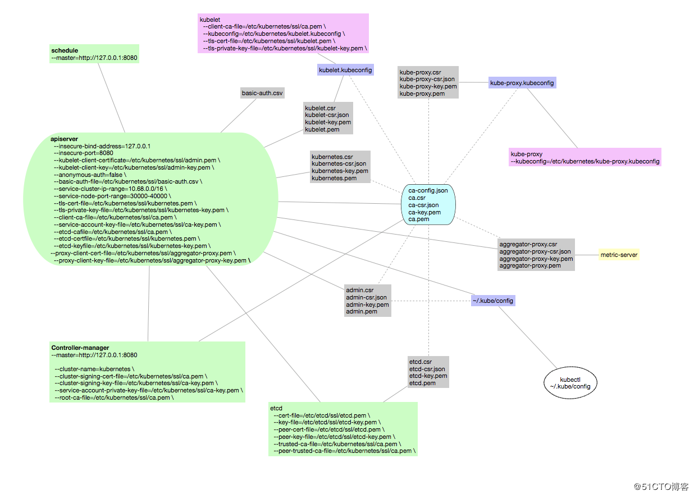

## kubernetes master

### kubernetes master 节点安装配置步骤

1. 下载或者拷贝相关二进制文件
2. 从工作节点拷贝 CA 证书和私钥，admin 证书和私钥
3. 生成 kubernetes、aggregator proxy 证书和私钥
4. 创建 basic-auth.csv
5. 创建 kube-apiserver、kube-controller-manager、kube-scheduler 的 systemd unit 文件
6. 启动服务
7. Making master nodes SchedulingDisabled
8. Setting master role name
9. 安装相关插件

### 相关配置说明如下

```bash
# 集群网络插件，可以支持calico, flannel, kube-router, cilium
CLUSTER_NETWORK="flannel"

# 服务网段 (Service CIDR），注意不要与内网已有网段冲突
SERVICE_CIDR="10.68.0.0/16"

# kubernetes 服务 IP (预分配，一般是 SERVICE_CIDR 中第一个IP)
CLUSTER_KUBERNETES_SVC_IP="10.68.0.1"

# 集群 DNS 服务 IP (从 SERVICE_CIDR 中预分配)
CLUSTER_DNS_SVC_IP="10.68.0.2"

# POD 网段 (Cluster CIDR），注意不要与内网已有网段冲突
CLUSTER_CIDR="172.20.0.0/16"

# 服务端口范围 (NodePort Range)
NODE_PORT_RANGE="20000-40000"

# 集群 DNS 域名
CLUSTER_DNS_DOMAIN="cluster.local."

# 需要说明的是集群的 apiserver 地址应该是负载均衡的地址
# MASTER_IP 为负载均衡主节点地址
MASTER_IP="192.168.1.12"
KUBE_APISERVER="https://192.168.1.12:8443"

# 集群 basic auth 使用的用户名和密码，用于 basic-auth.csv
BASIC_AUTH_USER="admin"
BASIC_AUTH_PASS="test1234"

```

### apiserver 参数说明

```bash
--requestheader-client-ca-file=/etc/kubernetes/ssl/ca.pem

--client-ca-file=/etc/kubernetes/ssl/ca.pem
--service-account-key-file=/etc/kubernetes/ssl/ca-key.pem

--kubelet-client-certificate=/etc/kubernetes/ssl/admin.pem
--kubelet-client-key=/etc/kubernetes/ssl/admin-key.pem

--tls-cert-file=/etc/kubernetes/ssl/kubernetes.pem
--tls-private-key-file=/etc/kubernetes/ssl/kubernetes-key.pem

--proxy-client-cert-file=/etc/kubernetes/ssl/aggregator-proxy.pem
--proxy-client-key-file=/etc/kubernetes/ssl/aggregator-proxy-key.pem

--basic-auth-file=/etc/kubernetes/ssl/basic-auth.csv

# --service-cluster-ip-range={{ SERVICE_CIDR }}
--service-cluster-ip-range=10.68.0.0/16

# --service-node-port-range={{ NODE_PORT_RANGE }}
--service-node-port-range=20000-40000

# etcd
--etcd-cafile=/etc/kubernetes/ssl/ca.pem
--etcd-certfile=/etc/kubernetes/ssl/kubernetes.pem
--etcd-keyfile=/etc/kubernetes/ssl/kubernetes-key.pem
--etcd-servers=https://192.168.1.1:2379,https://192.168.1.2:2379,https://192.168.1.2:2379

```

### kube-controller-manager 配置参数说明

```bash
# --service-cluster-ip-range={{ SERVICE_CIDR }}
--service-cluster-ip-range=10.68.0.0/16

# --cluster-cidr={{ CLUSTER_CIDR }}
--cluster-cidr=172.20.0.0/16

--cluster-signing-cert-file=/etc/kubernetes/ssl/ca.pem
--cluster-signing-key-file=/etc/kubernetes/ssl/ca-key.pem
--service-account-private-key-file=/etc/kubernetes/ssl/ca-key.pem
--root-ca-file=/etc/kubernetes/ssl/ca.pem

```

### kube-scheduler 配置参数说明

### kube master 相关命令

```bash
192.168.1.1
192.168.1.2

mkdir -p /opt/kube/bin /etc/kubernetes/ssl

# 从工作节点拷贝 kube-master 相关二进制文件
scp /etc/ansible/bin/kube-apiserver /opt/kube/bin/kube-apiserver
scp /etc/ansible/bin/kube-controller-manager /opt/kube/bin/kube-controller-manager
scp /etc/ansible/bin/kube-scheduler /opt/kube/bin/kube-scheduler

# 从工作节点拷贝 CA 证书和私钥
scp /etc/kubernetes/ssl/ca.pem /etc/kubernetes/ssl/ca.pem
scp /etc/kubernetes/ssl/ca-key.pem /etc/kubernetes/ssl/ca-key.pem
scp /etc/kubernetes/ssl/ca.csr /etc/kubernetes/ssl/ca.csr
scp /etc/kubernetes/ssl/ca-config.json /etc/kubernetes/ssl/ca-config.json
scp /etc/kubernetes/ssl/admin.pem /etc/kubernetes/ssl/admin.pem
scp /etc/kubernetes/ssl/admin-key.pem /etc/kubernetes/ssl/admin-key.pem

# 创建 kubernetes 证书签名请求，以 192.168.1.1 为例
# hosts 相当于扩展认证，即一个证书的网站可以是 *.youku.com，也是可以是 *.google.com
# 在 hosts 中配置 k8s 集群 master 节点证书配置，可以添加多个ip和域名
# 需要添加负载均衡的两个 ip
cat /etc/kubernetes/ssl/kubernetes-csr.json
{
  "CN": "kubernetes",
  "hosts": [
    "127.0.0.1",
    "192.168.1.12",
    "192.168.1.11",
    "192.168.1.1",
    "10.68.0.2",
    "kubernetes",
    "kubernetes.default",
    "kubernetes.default.svc",
    "kubernetes.default.svc.cluster",
    "kubernetes.default.svc.cluster.local"
  ],
  "key": {
    "algo": "rsa",
    "size": 2048
  },
  "names": [
    {
      "C": "CN",
      "ST": "WH",
      "L": "XS",
      "O": "k8s",
      "OU": "System"
    }
  ]
}

# 创建 kubernetes 证书和私钥
cd /etc/kubernetes/ssl && /opt/kube/bin/cfssl gencert \
        -ca=/etc/kubernetes/ssl/ca.pem \
        -ca-key=/etc/kubernetes/ssl/ca-key.pem \
        -config=/etc/kubernetes/ssl/ca-config.json \
        -profile=kubernetes kubernetes-csr.json | /opt/kube/bin/cfssljson -bare kubernetes

# 创建 aggregator proxy 证书签名请求
cat /etc/kubernetes/ssl/aggregator-proxy-csr.json
{
  "CN": "aggregator",
  "hosts": [],
  "key": {
    "algo": "rsa",
    "size": 2048
  },
  "names": [
    {
      "C": "CN",
      "ST": "HangZhou",
      "L": "XS",
      "O": "k8s",
      "OU": "System"
    }
  ]
}

# 创建 aggregator-proxy 证书和私钥
cd /etc/kubernetes/ssl && /opt/kube/bin/cfssl gencert \
        -ca=/etc/kubernetes/ssl/ca.pem \
        -ca-key=/etc/kubernetes/ssl/ca-key.pem \
        -config=/etc/kubernetes/ssl/ca-config.json \
        -profile=kubernetes aggregator-proxy-csr.json | /opt/kube/bin/cfssljson -bare aggregator-proxy
        
# 创建 basic-auth.csv
cat /etc/kubernetes/ssl/basic-auth.csv
test1234,admin,1
readonly,readonly,2
```



```bash
# 创建 kube-apiserver 的 systemd unit 文件，以 192.168.1.1 为例
cat /etc/systemd/system/kube-apiserver.service
[Unit]
Description=Kubernetes API Server
Documentation=https://github.com/GoogleCloudPlatform/kubernetes
After=network.target

[Service]
ExecStart=/opt/kube/bin/kube-apiserver \
  --admission-control=NamespaceLifecycle,LimitRanger,ServiceAccount,DefaultStorageClass,ResourceQuota,NodeRestriction,MutatingAdmissionWebhook,ValidatingAdmissionWebhook \
  --bind-address=192.168.1.1 \
  --insecure-bind-address=127.0.0.1 \
  --authorization-mode=Node,RBAC \
  --kubelet-https=true \
  --kubelet-client-certificate=/etc/kubernetes/ssl/admin.pem \
  --kubelet-client-key=/etc/kubernetes/ssl/admin-key.pem \
  --anonymous-auth=false \
  --basic-auth-file=/etc/kubernetes/ssl/basic-auth.csv \
  --service-cluster-ip-range=10.68.0.0/16 \
  --service-node-port-range=20000-40000 \
  --tls-cert-file=/etc/kubernetes/ssl/kubernetes.pem \
  --tls-private-key-file=/etc/kubernetes/ssl/kubernetes-key.pem \
  --client-ca-file=/etc/kubernetes/ssl/ca.pem \
  --service-account-key-file=/etc/kubernetes/ssl/ca-key.pem \
  --etcd-cafile=/etc/kubernetes/ssl/ca.pem \
  --etcd-certfile=/etc/kubernetes/ssl/kubernetes.pem \
  --etcd-keyfile=/etc/kubernetes/ssl/kubernetes-key.pem \
  --etcd-servers=https://192.168.1.1:2379,https://192.168.1.2:2379,https://192.168.1.2:2379 \
  --enable-swagger-ui=true \
  --endpoint-reconciler-type=lease \
  --allow-privileged=true \
  --audit-log-maxage=30 \
  --audit-log-maxbackup=3 \
  --audit-log-maxsize=100 \
  --audit-log-path=/var/lib/audit.log \
  --event-ttl=1h \
  --requestheader-client-ca-file=/etc/kubernetes/ssl/ca.pem \
  --requestheader-allowed-names= \
  --requestheader-extra-headers-prefix=X-Remote-Extra- \
  --requestheader-group-headers=X-Remote-Group \
  --requestheader-username-headers=X-Remote-User \
  --proxy-client-cert-file=/etc/kubernetes/ssl/aggregator-proxy.pem \
  --proxy-client-key-file=/etc/kubernetes/ssl/aggregator-proxy-key.pem \
  --enable-aggregator-routing=true \
  --runtime-config=batch/v2alpha1=true \
  --v=2
Restart=on-failure
RestartSec=5
Type=notify
LimitNOFILE=65536

[Install]
WantedBy=multi-user.target


############## 配置选项分类 ##############
Generic flags:

Etcd flags:(用于保护 apiserver 和 etcd 通信的 SSL 认证文件)
--etcd-cafile=/etc/kubernetes/ssl/ca.pem
--etcd-certfile=/etc/kubernetes/ssl/kubernetes.pem
--etcd-keyfile=/etc/kubernetes/ssl/kubernetes-key.pem
--etcd-servers=https://192.168.1.1:2379,https://192.168.1.2:2379,https://192.168.1.2:2379

Secure serving flags:
# File containing the default x509 Certificate for HTTPS. (CA cert, if any, concatenated after server cert). 
# If HTTPS serving is enabled, and --tls-cert-file and --tls-private-key-file are not provided, a self-signed certificate and key are generated for the public address and saved to the directory specified by --cert-dir.
# 包含HTTPS的默认x509证书的文件。 （CA证书，如果有的话，在服务器证书之后连接）。 如果启用了HTTPS服务，并且未提供--tls-cert-file和--tls-private-key-file，则会生成自签名证书和密钥用于公共地址并保存到--cert-dir指定的目录中。
--bind-address=192.168.1.1
--tls-cert-file=/etc/kubernetes/ssl/kubernetes.pem
--tls-private-key-file=/etc/kubernetes/ssl/kubernetes-key.pem

Insecure serving flags:（kube-controller-manager（--master=http://127.0.0.1:8080） 和 kube-scheduler（--master=http://127.0.0.1:8080） 与 apiserver 通信的 ip 和 port）
--insecure-bind-address=127.0.0.1

Auditing flags:
--audit-log-maxage=30
--audit-log-maxbackup=3
--audit-log-maxsize=100
--audit-log-path=/var/lib/audit.log

Features flags:
--enable-swagger-ui=true

Authentication flags:
--anonymous-auth=false
--basic-auth-file=/etc/kubernetes/ssl/basic-auth.csv

# If set, any request presenting a client certificate signed by one of the authorities in the client-ca-file is authenticated with an identity corresponding to the CommonName of the client certificate.
--client-ca-file=/etc/kubernetes/ssl/ca.pem

# File containing PEM-encoded x509 RSA or ECDSA private or public keys, used to verify ServiceAccount tokens. The specified file can contain multiple keys, and the flag can be specified multiple times with different files. 
# If unspecified, --tls-private-key-file is used. Must be specified when --service-account-signing-key is provided
--service-account-key-file=/etc/kubernetes/ssl/ca-key.pem

# Root certificate bundle to use to verify client certificates on incoming requests before trusting usernames in headers specified by --requestheader-username-headers. 
# WARNING: generally do not depend on authorization being already done for incoming requests.
--requestheader-client-ca-file=/etc/kubernetes/ssl/ca.pem
--requestheader-allowed-names=
--requestheader-extra-headers-prefix=X-Remote-Extra-
--requestheader-group-headers=X-Remote-Group
--requestheader-username-headers=X-Remote-User

Authorization flags:
--authorization-mode=Node,RBAC

Cloud provider flags:

Storage flags:

Api enablement flags:
--runtime-config=batch/v2alpha1=true

Admission flags:
--admission-control=NamespaceLifecycle,LimitRanger,ServiceAccount,DefaultStorageClass,ResourceQuota,NodeRestriction,MutatingAdmissionWebhook,ValidatingAdmissionWebhook

Misc flags:
--kubelet-https
# Path to a client cert file for TLS.
--kubelet-client-certificate=/etc/kubernetes/ssl/admin.pem
--kubelet-client-key=/etc/kubernetes/ssl/admin-key.pem

--service-cluster-ip-range=10.68.0.0/16
--service-node-port-range=20000-40000
--endpoint-reconciler-type=lease
--allow-privileged=true
--event-ttl=1h

# Client certificate used to prove the identity of the aggregator or kube-apiserver when it must call out during a request. This includes proxying requests to a user api-server and calling out to webhook admission plugins. 
# It is expected that this cert includes a signature from the CA in the --requestheader-client-ca-file flag. 
# That CA is published in the 'extension-apiserver-authentication' configmap in the kube-system namespace. Components receiving calls from kube-aggregator should use that CA to perform their half of the mutual TLS verification.
--proxy-client-cert-file=/etc/kubernetes/ssl/aggregator-proxy.pem
--proxy-client-key-file=/etc/kubernetes/ssl/aggregator-proxy-key.pem
--enable-aggregator-routing=true

Global flags:
--v=2


# 其他相关选项说明
$ head -c 16 /dev/urandom | od -An -t x | tr -d ' '
ab20dd9bb7cda46e449a09f3f2a81086
$

$ vim /opt/kubernetes/ssl/bootstrap-token.csv
ab20dd9bb7cda46e449a09f3f2a81086,kubelet-bootstrap,10001,"system:kubelet-bootstrap"

--enable-bootstrap-token-auth
--token-auth-file=/opt/kubernetes/ssl/bootstrap-token.csv

# kubelet 启动时会向 kube-apiserver 发送 tsl bootstrap 请求，所以需要将 bootstrap 的 token设置成对应的角色，这样 kubectl 才有权限创建该请求。

$ kubectl create clusterrolebinding kubelet-bootstrap --clusterrole=system:node-bootstrapper --user=kubelet-bootstrap

$ kubectl config set-credentials kubelet-bootstrap \
   --token=ab20dd9bb7cda46e449a09f3f2a81086 \
   --kubeconfig=bootstrap.kubeconfig   


# 创建 kube-controller-manager 的 systemd unit 文件
cat /etc/systemd/system/kube-controller-manager.service
[Unit]
Description=Kubernetes Controller Manager
Documentation=https://github.com/GoogleCloudPlatform/kubernetes

[Service]
ExecStart=/opt/kube/bin/kube-controller-manager \
  --address=127.0.0.1 \
  --master=http://127.0.0.1:8080 \
  --allocate-node-cidrs=true \
  --service-cluster-ip-range=10.68.0.0/16 \
  --cluster-cidr=172.20.0.0/16 \
  --cluster-name=kubernetes \
  --cluster-signing-cert-file=/etc/kubernetes/ssl/ca.pem \
  --cluster-signing-key-file=/etc/kubernetes/ssl/ca-key.pem \
  --service-account-private-key-file=/etc/kubernetes/ssl/ca-key.pem \
  --root-ca-file=/etc/kubernetes/ssl/ca.pem \
  --horizontal-pod-autoscaler-use-rest-clients=true \  # 新版本没有该选项
  --leader-elect=true \
  --v=2
Restart=on-failure
RestartSec=5

[Install]
WantedBy=multi-user.target


############## 配置选项分类 ##############

Debugging flags:
Generic flags:
--allocate-node-cidrs=true
--cluster-cidr=172.20.0.0/16
--cluster-name=kubernetes
--leader-elect=true

Service controller flags:
Secure serving flags:
Insecure serving flags:
--address=127.0.0.1

Authentication flags:
Authorization flags:
Attachdetach controller flags:
Csrsigning controller flags:
--cluster-signing-cert-file=/etc/kubernetes/ssl/ca.pem
--cluster-signing-key-file=/etc/kubernetes/ssl/ca-key.pem

Deployment controller flags:
Deprecated flags:
Endpoint controller flags:
Garbagecollector controller flags:
Horizontalpodautoscaling controller flags:
--horizontal-pod-autoscaler-use-rest-clients=true # 新版本没有该选项

Namespace controller flags:
Nodeipam controller flags:
--service-cluster-ip-range=10.68.0.0/16

Nodelifecycle controller flags:
Persistentvolume-binder controller flags:
Podgc controller flags:
Replicaset controller flags:
Replicationcontroller flags:
Resourcequota controller flags:
Serviceaccount controller flags:
--service-account-private-key-file=/etc/kubernetes/ssl/ca-key.pem
--root-ca-file=/etc/kubernetes/ssl/ca.pem

Ttl-after-finished controller flags:
Misc flags:
--master=http://127.0.0.1:8080

Global flags:
--v=2


# 创建 kube-scheduler 的 systemd unit 文件
cat /etc/systemd/system/kube-scheduler.service
[Unit]
Description=Kubernetes Scheduler
Documentation=https://github.com/GoogleCloudPlatform/kubernetes

[Service]
ExecStart=/opt/kube/bin/kube-scheduler \
  --address=127.0.0.1 \
  --master=http://127.0.0.1:8080 \
  --leader-elect=true \
  --v=2
Restart=on-failure
RestartSec=5

[Install]
WantedBy=multi-user.target


############## 配置选项分类 ##############

Misc flags:
--master=http://127.0.0.1:8080

Secure serving flags:
Insecure serving flags:
--address=127.0.0.1

Authentication flags:
Authorization flags:
Deprecated flags:
Leader election flags:
--leader-elect=true

Feature gate flags:
Global flags:
--v=2


systemctl enable kube-apiserver kube-controller-manager kube-scheduler
systemctl daemon-reload
systemctl restart kube-apiserver
systemctl restart kube-controller-manager
systemctl restart kube-scheduler

kubectl get node

# Making master nodes SchedulingDisabled，以 192.168.1.1 为例
/opt/kube/bin/kubectl cordon 192.168.1.1

# Setting master role name，以 192.168.1.1 为例
/opt/kube/bin/kubectl label node 192.168.1.1 kubernetes.io/role=master --overwrite

```


