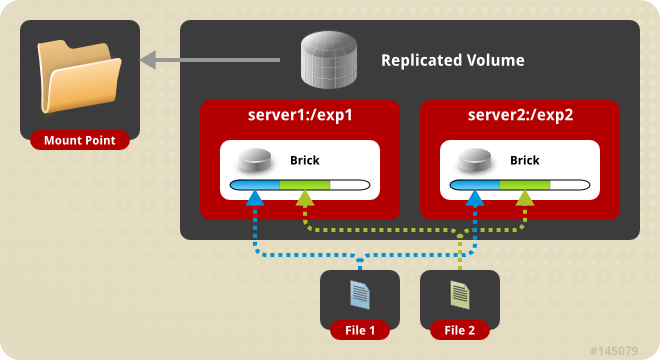
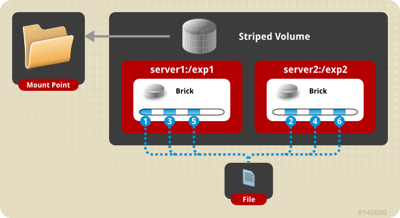

# Types of Volumes

Volume is the collection of bricks and most of the gluster file system operations happen on the volume. Gluster file system supports different types of volumes based on the requirements. Some volumes are good for scaling storage size, some for improving performance and some for both.  卷是砖块的集合，大多数gluster文件系统操作都发生在卷上。 Gluster文件系统根据要求支持不同类型的卷。 有些卷适用于扩展存储大小，有些用于提高性能，有些用于提高性能。

1. **Distributed Glusterfs Volume** - This is the default glusterfs volume i.e, while creating a volume if you do not specify the type of the volume, the default option is to create a distributed volume. Here, files are distributed across various bricks in the volume. So file1 may be stored only in brick1 or brick2 but not on both. Hence there is no data redundancy. The purpose for such a storage volume is to easily & cheaply scale the volume size. However this also means that a brick failure will lead to complete loss of data and one must rely on the underlying hardware for data loss protection.  这是默认的glusterfs卷，即，如果未指定卷的类型，则在创建卷时，默认选项是创建分布式卷。 这里，文件分布在卷中的各个砖块中。 因此file1可能只存储在brick1或brick2中，但不能存储在两者中。 因此没有数据冗余。 这种存储容量的目的是容易且廉价地缩放卷大小。 然而，这也意味着砖块故障将导致数据完全丢失，并且必须依靠底层硬件来保护数据丢失。


Distributed volume

Create a Distributed Volume

** gluster volume create NEW-VOLNAME [transport [tcp | rdma | tcp,rdma]] NEW-BRICK... **

For example to create a distributed volume with four storage servers using TCP.

```bash
gluster volume create test-volume server1:/exp1 server2:/exp2 server3:/exp3 server4:/exp4
Creation of test-volume has been successful
Please start the volume to access data
```

To display the volume info

```bash
#gluster volume info
Volume Name: test-volume
Type: Distribute
Status: Created
Number of Bricks: 4
Transport-type: tcp
Bricks:
Brick1: server1:/exp1
Brick2: server2:/exp2
Brick3: server3:/exp3
Brick4: server4:/exp4
```

2. **Replicated Glusterfs Volume** - In this volume we overcome the data loss problem faced in the distributed volume. Here exact copies of the data are maintained on all bricks. The number of replicas in the volume can be decided by client while creating the volume. So we need to have at least two bricks to create a volume with 2 replicas or a minimum of three bricks to create a volume of 3 replicas. One major advantage of such a volume is that even if one brick fails the data can still be accessed from its replicated bricks. Such a volume is used for better reliability and data redundancy.  在本卷中，我们克服了分布式卷中面临的数据丢失问题。 在这里，所有砖块都保留了精确的数据副本。 在创建卷时，客户端可以决定卷中的副本数。 因此，我们需要至少有两块砖来创建一个包含2个副本或至少3个砖块的卷，以创建3个副本的卷。 这种卷的一个主要优点是，即使一块砖出现故障，仍然可以从其复制的砖块中访问数据。 这样的卷用于更好的可靠性和数据冗余。


Replicated volume

Create a Replicated Volume

** gluster volume create NEW-VOLNAME [replica COUNT] [transport [tcp | rdma | tcp,rdma]] NEW-BRICK... ** 

For example, to create a replicated volume with two storage servers:

```bash
# gluster volume create test-volume replica 2 transport tcp server1:/exp1 server2:/exp2
Creation of test-volume has been successful
Please start the volume to access data
```

3. Distributed Replicated Glusterfs Volume - In this volume files are distributed across replicated sets of bricks. The number of bricks must be a multiple of the replica count. Also the order in which we specify the bricks matters since adjacent bricks become replicas of each other. This type of volume is used when high availability of data due to redundancy and scaling storage is required. So if there were eight bricks and replica count 2 then the first two bricks become replicas of each other then the next two and so on. This volume is denoted as 4x2. Similarly if there were eight bricks and replica count 4 then four bricks become replica of each other and we denote this volume as 2x4 volume.  在此卷文件中分布在复制的砖块集中。 砖的数量必须是复制计数的倍数。 此外，我们指定砖的顺序很重要，因为相邻的砖成为彼此的复制品。 当需要由于冗余和扩展存储而导致数据的高可用性时，使用这种类型的卷。 因此，如果有8个砖块和副本计数2，则前两个砖块将成为彼此的复制品，然后是接下来的两个砖块，依此类推。 该体积表示为4×2。 同样，如果有8块砖和4块复制品，则4块砖成为彼此的复制品，我们将该体积表示为2x4体积。


Distributed Replicated volume

Create the distributed replicated volume:

** gluster volume create NEW-VOLNAME [replica COUNT] [transport [tcp | rdma | tcp,rdma]] NEW-BRICK... **

For example, four node distributed (replicated) volume with a two-way mirror:

```bash
# gluster volume create test-volume replica 2 transport tcp server1:/exp1 server2:/exp2 server3:/exp3 server4:/exp4
Creation of test-volume has been successful
Please start the volume to access data
```

4. Striped Glusterfs Volume - Consider a large file being stored in a brick which is frequently accessed by many clients at the same time. This will cause too much load on a single brick and would reduce the performance. In striped volume the data is stored in the bricks after dividing it into different stripes. So the large file will be divided into smaller chunks (equal to the number of bricks in the volume) and each chunk is stored in a brick. Now the load is distributed and the file can be fetched faster but no data redundancy provided.  考虑将大型文件存储在砖块中，许多客户端经常同时访问该块。 这将导致单块砖上的负载过大，从而降低性能。 在条带化体积中，数据在将其分成不同的条带后存储在砖块中。 因此，大文件将被分成较小的块（等于卷中的块数），并且每个块都存储在一块砖中。 现在负载是分布式的，文件可以更快地获取，但不提供数据冗余。


Striped volume

Create a Striped Volume

** gluster volume create NEW-VOLNAME [stripe COUNT] [transport [tcp | dma | tcp,rdma]] NEW-BRICK... **

For example, to create a striped volume across two storage servers:

```bash
# gluster volume create test-volume stripe 2 transport tcp server1:/exp1 server2:/exp2
Creation of test-volume has been successful
Please start the volume to access data
```

5. Distributed Striped Glusterfs Volume - This is similar to Striped Glusterfs volume except that the stripes can now be distributed across more number of bricks. However the number of bricks must be a multiple of the number of stripes. So if we want to increase volume size we must add bricks in the multiple of stripe count.  这类似于条纹Glusterfs卷，除了条纹现在可以分布在更多数量的砖块上。 但是砖的数量必须是条纹数量的倍数。 因此，如果我们想要增加卷大小，我们必须在多个条带计数中添加砖块。


Distributed Striped volume

Create the distributed striped volume:

** gluster volume create NEW-VOLNAME [stripe COUNT] [transport [tcp | rdma | tcp,rdma]] NEW-BRICK... **

For example, to create a distributed striped volume across eight storage servers:

```bash
# gluster volume create test-volume stripe 4 transport tcp
 server1:/exp1 server2:/exp2 server3:/exp3 server4:/exp4 server5:/exp5 server6:/exp6 server7:/exp7 server8:/exp8
Creation of test-volume has been successful
Please start the volume to access data.
```
