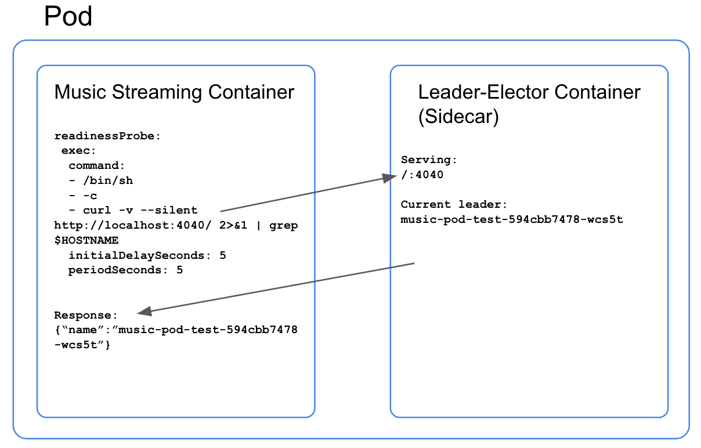

# Implementing leader election for Kubernetes pods

There are certain workloads, such as TuneIn’s own music streaming architecture that runs on Kubernetes, where it makes sense to use a leader election framework for pods. In our case, we want our music streams to be redundant so that in the event of a pod failure, we have a warm standby to take over the audio stream and minimize ‘dead air’. To accomplish this, we instantiate two pods for each station: one to act as the primary and one to serve as a warm standby. We only want one of these pods to be serving music to our CDN at a time, which we have achieved by implementing a combination of leader-election and a container readiness probe.  有一些工作负载，例如TuneIn自己的音乐流体系结构，在Kubernetes上运行，使用领导者选举框架进行pod是有意义的。 在我们的例子中，我们希望我们的音乐流是多余的，以便在发生pod故障时，我们有一个热备份来接管音频流并最小化“死气”。 为了实现这一点，我们为每个站实例化两个pod：一个用作主要，另一个用作热备用。 我们只希望其中一个pod一次为我们的CDN提供音乐，我们通过实施领导者选举和容器准备探测的组合来实现。

Fortunately, a basic leader election framework already exists for Kubernetes: https://github.com/kubernetes/contrib/tree/master/election. This lightweight framework implements a nice and simple leader election mechanism that we can run as a sidecar to our main music streaming container. The leader election sidecar hosts an endpoint at :4040 that we can query from our container readiness probe to determine whether or not it is the currently elected leader. If it is, it will pass the readiness check and allow the service to route traffic to it. If it’s not the current leader, then it will simply fail the readiness check and will not be routable from the Kubernetes service resource. This solution can be adapted to virtually any pod workload.  幸运的是，Kubernetes已经存在一个基本的领导者选举框架：https：//github.com/kubernetes/contrib/tree/master/election。 这个轻量级框架实现了一个漂亮而简单的领导者选举机制，我们可以将其作为主要音乐流容器的边车运行。 领导者选举边车在4040处托管端点，我们可以从我们的容器准备情况调查中查询，以确定它是否是当前选出的领导者。 如果是，它将通过准备情况检查并允许服务将流量路由到它。 如果它不是当前的领导者，那么它将完全不通过准备检查，并且不能从Kubernetes服务资源路由。 该解决方案几乎可以适应任何pod工作负载。



This diagram demonstrates the request/response mechanism that curls the leader-elector sidecar and greps the response for the $HOSTNAME of the requesting container. The output from that curl command returns the pod name for the currently elected leader, which looks like this:  此图演示了请求/响应机制，该机制卷曲了leader-elector sidecar并且对请求容器的$ HOSTNAME的响应进行了greps。 该curl命令的输出返回当前选举的leader的pod名称，如下所示：

```bash
$ curl http://localhost:4040/
{"name":"music-pod-test-594cbb7478-wcs5t"}
```

If the response contains the name of the requesting pod, then grep will return a 0 exit code and the readinessProbe will succeed. If the response does not contain the name of the requesting pod, then grep will return a 1exit code and it is assumed that it is NOT the currently elected leader and the readinessProbe will fail and try again in 5 seconds.  如果响应包含请求pod的名称，则grep将返回0退出代码，readinessProbe将成功。 如果响应不包含请求pod的名称，则grep将返回1exit代码，并且假定它不是当前选出的leader并且readinessProbe将失败并在5秒内再次尝试。

Here’s what the pod status looks like when one of the pods is elected as a leader:

```bash
~> kubectl get pods -n leader-election-test
NAME                              READY STATUS    RESTARTS AGE
music-pod-test-594cbb7478-bh625   1/2   Running   0        1m
music-pod-test-594cbb7478-wcs5t   2/2   Running   0        1m
```

In the snippet above, each pod is running two containers: the leader-elector container and our music streaming container.

Here is what the replicaSet looks like when one of the pods is elected as a leader:

```bash
~> kubectl get rs -n leader-election-test
NAME                      DESIRED CURRENT READY AGE
music-pod-test-594cbb7478 2       2       1     1m
```

In the snippet above, the status shows only 1 pod as ‘Ready’, which is exactly what we want. In this configuration, we have one ‘active’ pod and one ‘standby’ pod.

You can use the following manifest to test this yourself:

```
---
apiVersion: v1
kind: Namespace
metadata:
  name: "leader-election-test"
---
apiVersion: v1
kind: ServiceAccount
metadata:
  name: leader-election-test
  namespace: "leader-election-test"
  labels:
    app: leader-election-test
---
apiVersion: rbac.authorization.k8s.io/v1beta1
kind: ClusterRole
metadata:
  name: leader-election-test
  namespace: "leader-election-test"
  labels:
    app: leader-election-test
rules:
  - apiGroups: [""]
    resources: ["endpoints"]
    verbs: ["*"]
---
apiVersion: rbac.authorization.k8s.io/v1beta1
kind: ClusterRoleBinding
metadata:
  name: leader-election-test
  labels:
    app: leader-election-test
roleRef:
  apiGroup: rbac.authorization.k8s.io
  kind: ClusterRole
  name: leader-election-test
subjects:
  - name: leader-election-test
    namespace: "leader-election-test"
    kind: ServiceAccount
---
apiVersion: apps/v1beta1
kind: Deployment
metadata:
  name: music-pod-test
  namespace: "leader-election-test"
  labels:
    app: leader-election-test
spec:
  replicas: 2
  selector:
    matchLabels:
      app: leader-election-test
  template:
    metadata:
      labels:
        app: leader-election-test
      annotations:
    spec:
      serviceAccountName: leader-election-test
      containers:
        - name: nginx
          image: nginx
          ports:
          - containerPort: 80
          lifecycle:
            postStart:
              exec:
                command:
                  - "sh"
                  - "-c"
                  - >
                    apt-get update;
                    apt-get install -y curl;
          readinessProbe:
            exec:
              command:
              - /bin/sh
              - -c
              - curl -v --silent http://localhost:4040/ 2>&1 | grep $HOSTNAME
            initialDelaySeconds: 5
            periodSeconds: 5
        - name: leader-election-test
          image: "k8s.gcr.io/leader-elector:0.5"
          args:
          - --election=example
          - --http=0.0.0.0:4040
          imagePullPolicy: IfNotPresent
          ports:
          - containerPort: 4040
```

This setup allows us to have only 1 pod serving music to our CDN at a time. If for any reason the master pod terminates or becomes unhealthy, a new leader will be elected, will become ‘Ready’, and will start receiving traffic from its service.  此设置允许我们一次只有1个pod为我们的CDN提供音乐。 如果主吊舱因任何原因终止或变得不健康，将选出新的领导者，将变为“准备就绪”，并将开始从其服务接收流量。

