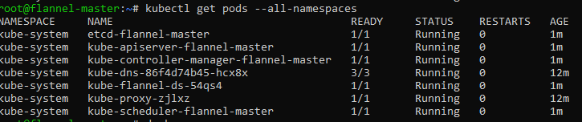
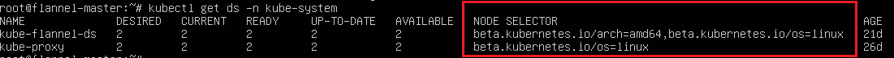

# Network Solutions

Once you have setup a Kubernetes master node you are ready to pick a networking solution. There are multiple ways to make the virtual cluster subnet routable across nodes. Pick one of the following options for Kubernetes on Windows today:  设置Kubernetes主节点后，您就可以选择网络解决方案了。 有多种方法可使虚拟群集子网跨节点路由。 立即在Windows上为Kubernetes选择以下选项之一：

1. Use a CNI plugin such as Flannel to setup an overlay network for you.
2. Use a CNI plugin such as Flannel to program routes for you.
3. Configure a smart top-of-rack (ToR) switch to route the subnet.

Tip:
There is a fourth networking solution on Windows which leverages Open vSwitch (OvS) and Open Virtual Network (OVN). Documenting this is out of scope for this document, but you can read these instructions to set it up.  Windows上有第四种网络解决方案，它利用Open vSwitch（OvS）和开放虚拟网络（OVN）。 记录此文档超出了本文档的范围，但您可以阅读这些说明进行设置。

## Flannel in vxlan mode

Flannel in vxlan mode can be used to setup a configurable virtual overlay network which uses VXLAN tunneling to route packets between nodes.  Vxlan模式下的Flannel可用于设置可配置的虚拟覆盖网络，该网络使用VXLAN隧道在节点之间路由数据包。

### Prepare Kubernetes master for Flannel

Some minor preparation is recommended on the Kubernetes master in our cluster. It is recommended to enable bridged IPv4 traffic to iptables chains when using Flannel. This can be done using the following command:  我们的集群中的Kubernetes master建议进行一些小的准备工作。 建议在使用Flannel时启用桥接IPv4流量到iptables链。 这可以使用以下命令完成：

```bash
sudo sysctl net.bridge.bridge-nf-call-iptables=1
```

### Download & configure Flannel

Download the most recent Flannel manifest:

```bash
wget https://raw.githubusercontent.com/coreos/flannel/master/Documentation/kube-flannel.yml
```

There are two sections you should modify to enable the vxlan networking backend:  您应该修改两个部分以启用vxlan网络后端：

1. In the `net-conf.json` section of your `kube-flannel.yml`, double-check:

* The cluster subnet (e.g. "10.244.0.0/16") is set as desired.  根据需要设置集群子网（例如“10.244.0.0/16”）。
* VNI 4096 is set in the backend
* Port 4789 is set in the backend

2. In the `cni-conf.json` section of your `kube-flannel.yml`, change the network name to "vxlan0".

After applying the above steps, your `net-conf.json` should look as follows:

```bash
net-conf.json: |
    {
      "Network": "10.244.0.0/16",
      "Backend": {
        "Type": "vxlan",
        "VNI" : 4096,
        "Port": 4789
      }
    }
```

Note:
The VNI must be set to 4096 and port 4789 for Flannel on Linux to interoperate with Flannel on Windows. Support for other VNIs is coming soon. See VXLAN for an explanation of these fields.  必须将VNI设置为4096，将端口4789设置为Linux上的Flannel，以便与Windows上的Flannel进行互操作。 即将推出对其他VNI的支持。 有关这些字段的说明，请参见VXLAN。

Your `cni-conf.json` should look as follows:

```bash
cni-conf.json: |
    {
      "name": "vxlan0",
      "plugins": [
        {
          "type": "flannel",
          "delegate": {
            "hairpinMode": true,
            "isDefaultGateway": true
          }
        },
        {
          "type": "portmap",
          "capabilities": {
            "portMappings": true
          }
        }
      ]
    }
```

Tip:
For more information on the above options, please consult official CNI flannel, portmap, and bridge plugin docs for Linux.

### Launch Flannel & validate

Launch Flannel using:

```bash
kubectl apply -f kube-flannel.yml
```

Next, since the Flannel pods are Linux-based, apply the Linux NodeSelector patch to kube-flannel-ds DaemonSet to only target Linux (we will launch the Flannel "flanneld" host-agent process on Windows later when joining):  接下来，由于Flannel pod是基于Linux的，因此将Linux NodeSelector补丁应用于kube-flannel-ds DaemonSet以仅定位到Linux（我们将在以后加入时在Windows上启动Flannel“flanneld”主机代理进程）：

```bash
kubectl patch ds/kube-flannel-ds-amd64 --patch "$(cat node-selector-patch.yml)" -n=kube-system
```

Tip:
If any nodes aren't x86-64 based, replace `-amd64` above with your processor architecture.

After a few minutes, you should see all the pods as running if the Flannel pod network was deployed.

```bash
kubectl get pods --all-namespaces
```



The Flannel DaemonSet should also have the NodeSelector `beta.kubernetes.io/os=linux` applied.

```bash
kubectl get ds -n kube-system
```



Tip:
For the remaining flannel-ds-\* DaemonSets, these can be either ignored or deleted as they won't be scheduled if there are no nodes matching that processor architecture.  对于剩余的flannel-ds- * DaemonSets，可以忽略或删除这些，因为如果没有与该处理器体系结构匹配的节点，则不会对它们进行调度。

Tip:
Confused? Here is a complete example kube-flannel.yml For Flannel v0.11.0 with these 2 steps pre-applied for default cluster subnet 10.244.0.0/16.

Once successful, continue to the next steps.

## Flannel in host-gateway mode

## Configuring a ToR switch

