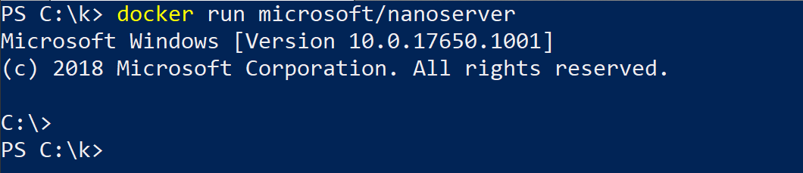
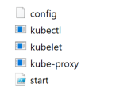

# Joining Windows Server Nodes to a Cluster

Once you have setup a Kubernetes master node and selected your desired network solution, you are ready to join Windows Server nodes to form a cluster. This requires some preparation on the Windows nodes before joining.

## Preparing a Windows node

Note:
All code snippets in Windows sections are to be run in elevated PowerShell.  Windows部分中的所有代码段都将在提升的PowerShell中运行。

### Install Docker (requires reboot)

Kubernetes uses Docker as its container engine, so we need to install it. You can follow the official Docs instructions, the Docker instructions, or try these steps:

```
Install-Module -Name DockerMsftProvider -Repository PSGallery -Force
Install-Package -Name Docker -ProviderName DockerMsftProvider
Restart-Computer -Force
```

If you are behind a proxy, the following PowerShell environment variables must be defined:

```
[Environment]::SetEnvironmentVariable("HTTP_PROXY", "http://proxy.example.com:80/", [EnvironmentVariableTarget]::Machine)
[Environment]::SetEnvironmentVariable("HTTPS_PROXY", "http://proxy.example.com:443/", [EnvironmentVariableTarget]::Machine)
```

If after reboot you see the following error:


Then start the docker service manually:

```
Start-Service docker
```

### Create the "pause" (infrastructure) image

Important:
It's important to be careful of conflicting container images; not having the expected tag can cause a docker pull of an incompatible container image, causing deployment problems such as indefinite ContainerCreating status.  小心冲突的容器图像是很重要的; 没有预期的标记会导致Docker拉出不兼容的容器映像，从而导致部署问题，例如无限期的ContainerCreating状态。

Now that docker is installed, you need to prepare a "pause" image that's used by Kubernetes to prepare the infrastructure pods. There are three steps to this:  现在已经安装了docker，您需要准备一个Kubernetes用来准备基础架构pod的“暂停”映像。 这有三个步骤：

1. pulling the image
2. tagging it as microsoft/nanoserver:latest
3. and running it

#### Pull the image

Pull the image for your specific Windows release. For example, if you are running Windows Server 2019:

```
docker pull mcr.microsoft.com/windows/nanoserver:1809
```

#### Tag the image

The Dockerfiles you will use later in this guide look for the :latest image tag. Tag the nanoserver image you just pulled as follows:

```
docker tag mcr.microsoft.com/windows/nanoserver:1809 microsoft/nanoserver:latest
```

#### Run the container

Double-check that the container actually runs on your computer:

```
docker run microsoft/nanoserver:latest
```

You should see something like this:



Tip:
If you cannot run the container please see: matching container host version with container image

#### Prepare Kubernetes for Windows directory

Create a "Kubernetes for Windows" directory to store Kubernetes binaries as well as any deployment scripts and config files.

```
mkdir c:\k
```

#### Copy Kubernetes certificate

Copy the Kubernetes certificate file ($HOME/.kube/config) from master to this new C:\k directory.

Tip:
You can use tools such as xcopy or WinSCP to transfer the config file between nodes.

#### Download Kubernetes binaries

To be able to run Kubernetes, you first need to download the `kubectl`, `kubelet`, and `kube-proxy` binaries. You can download these from the links in the `CHANGELOG.md` file of the latest releases.

* For example, here are the v1.14 Node Binaries.
* Use a tool like Expand-Archive to extract the archive and place the binaries into C:\k\.

#### (Optional) Setup kubectl on Windows

Should you wish to control the cluster from Windows, you can do so using the `kubectl` command. First, to make `kubectl` available outside of the C:\k\ directory, modify the PATH environment variable:

```
$env:Path += ";C:\k"
```

If you would like to make this change permanent, modify the variable in machine target:

```
[Environment]::SetEnvironmentVariable("Path", $env:Path + ";C:\k", [EnvironmentVariableTarget]::Machine)
```

Next, we will verify that the cluster certificate is valid. In order to set the location where `kubectl` looks for the configuration file, you can pass the `--kubeconfig` parameter or modify the `KUBECONFIG` environment variable. For example, if the configuration is located at `C:\k\config`:

```
$env:KUBECONFIG="C:\k\config"
```

To make this setting permanent for current user's scope:

```
[Environment]::SetEnvironmentVariable("KUBECONFIG", "C:\k\config", [EnvironmentVariableTarget]::User)
```

Finally, to check if the configuration has been discovered properly, you can use:

```
kubectl config view
```

If you are receiving a connection error,

```
Unable to connect to the server: dial tcp [::1]:8080: connectex: No connection could be made because the target machine actively refused it.
```

You should double-check the kubeconfig location or try to copy it over again.

If you see no errors the node is now ready to join the cluster.

## Joining the Windows node

Depending on networking solution you chose, you can:

1. Join Windows Server nodes to a Flannel (vxlan or host-gw) cluster
2. Join Windows Server nodes to a cluster with a ToR switch

### Joining a Flannel cluster

There is a collection of Flannel deployment scripts on this Microsoft repository that helps you join this node to the cluster.  此Microsoft存储库上有一组Flannel部署脚本，可帮助您将此节点加入群集。

Download the Flannel start.ps1 script, the contents of which should be extracted to C:\k:

```
[Net.ServicePointManager]::SecurityProtocol = [Net.SecurityProtocolType]::Tls12
wget https://raw.githubusercontent.com/Microsoft/SDN/master/Kubernetes/flannel/start.ps1 -o c:\k\start.ps1
```

Assuming you prepared your Windows node, and your c:\k directory looks as below, you are ready to join the node.



#### Join node

To simplify the process of joining a Windows node, you only need to run a single Windows script to launch kubelet, kube-proxy, flanneld, and join the node.  要简化加入Windows节点的过程，您只需运行单个Windows脚本即可启动kubelet，kube-proxy，flanneld和加入节点。

Note:
start.ps1 references install.ps1, which will download additional files such as the flanneld executable and the Dockerfile for infrastructure pod and install those for you. For overlay networking mode, the firewall will be opened for local UDP port 4789. There may be multiple powershell windows being opened/closed as well as a few seconds of network outage while the new external vSwitch for the pod network is being created the first time.  start.ps1引用install.ps1，它将下载其他文件，如flanneld可执行文件和Dockerfile for infrastructure pod，并为您安装。 对于覆盖网络模式，将为本地UDP端口4789打开防火墙。可能有多个PowerShell窗口被打开/关闭以及几秒钟的网络中断，同时第一次创建用于pod网络的新外部vSwitch。

```
cd c:\k
.\start.ps1 -ManagementIP <Windows Node IP> -NetworkMode <network mode>  -ClusterCIDR <Cluster CIDR> -ServiceCIDR <Service CIDR> -KubeDnsServiceIP <Kube-dns Service IP> -LogDir <Log directory>
```

* ManagementIP
* NetworkMode
* ClusterCIDR
* ServiceCIDR
* KubeDnsServiceIP
* InterfaceName
* LogDir

Tip:
You already noted down the cluster subnet, service subnet, and kube-DNS IP from the Linux master earlier

After running this you should be able to:

* View joined Windows nodes using `kubectl get nodes`
* See 3 powershell windows open, one for `kubelet`, one for `flanneld`, and another for `kube-proxy`
* See host-agent processes for `flanneld`, `kubelet`, and `kube-proxy` running on the node

If successful, continue to the next steps.

## Joining a ToR cluster
