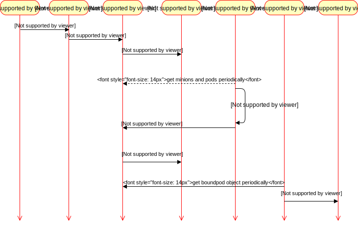

## Kubetnetes 中 pod 创建流程

Pod 是 Kubernetes 中最基本的部署调度单元，可以包含 container，逻辑上表示某种应用的一个实例。例如一个web 站点应用由前端、后端及数据库构建而成，这三个组件将运行在各自的容器中，那么我们可以创建包含三个container 的 pod。

Kubetnetes 中 pod 创建流程如下图所示

具体的创建步骤包括：

1. 客户端提交创建请求，可以通过 API Server 的 Restful API，也可以使用 kubectl 命令行工具。支持的数据类型包括JSON和YAML。

2. API Server 处理用户请求，存储 Pod 数据到 etcd。

3. schedule 通过 API Server 查看未绑定的 Pod，尝试为 Pod 分配主机。

4. 过滤主机 (调度预选)：调度器用一组规则过滤掉不符合要求的主机。比如 Pod 指定了所需要的资源量，那么可用资源比 Pod 需要的资源量少的主机会被过滤掉。

5. 主机打分(调度优选)：对第一步筛选出的符合要求的主机进行打分，在主机打分阶段，调度器会考虑一些整体优化策略，比如把容一个 Replication Controller 的副本分布到不同的主机上，使用最低负载的主机等。

6. 选择主机：选择打分最高的主机，进行 binding 操作，结果存储到 etcd 中。

7. kubelet 根据调度结果执行 Pod 创建操作： 绑定成功后，scheduler 会调用 APIServer 的 API 在 etcd 中创建一个 boundpod 对象，描述在一个工作节点上绑定运行的所有 pod 信息。运行在每个工作节点上的 kubelet 也会定期与 APIServer 同步 boundpod 信息，一旦发现应该在该工作节点上运行的 boundpod 对象没有更新，则调用Docker API 创建并启动 pod 内的容器。
