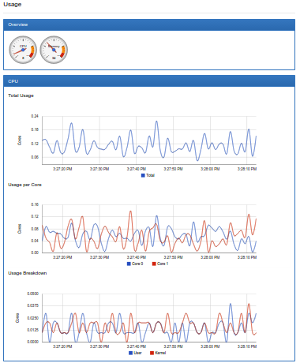

# Tools for Monitoring Resources

To scale an application and provide a reliable service, you need to understand how the application behaves when it is deployed. You can examine application performance in a Kubernetes cluster by examining the containers, pods, services, and the characteristics of the overall cluster. Kubernetes provides detailed information about an application’s resource usage at each of these levels. This information allows you to evaluate your application’s performance and where bottlenecks can be removed to improve overall performance.  要扩展应用程序并提供可靠的服务，您需要了解应用程序在部署时的行为方式。 您可以通过检查容器，窗格，服务以及整个群集的特征来检查Kubernetes群集中的应用程序性能。 Kubernetes提供有关每个级别的应用程序资源使用情况的详细信息。 通过此信息，您可以评估应用程序的性能以及可以消除瓶颈的位置，从而提高整体性能。

* [Resource metrics pipeline]()

* [Full metrics pipelines]()

* [CronJob monitoring]()

In Kubernetes, application monitoring does not depend on a single monitoring solution. On new clusters, you can use two separate pipelines to collect monitoring statistics by default:  在Kubernetes中，应用程序监视不依赖于单个监视解决方案。 在新群集上，默认情况下，您可以使用两个单独的管道来收集监视统计信息：

* The `resource metrics pipeline` provides a limited set of metrics related to cluster components such as the HorizontalPodAutoscaler controller, as well as the `kubectl top` utility. These metrics are collected by `metrics-server` and are exposed via the `metrics.k8s.io` API. `metrics-server` discovers all nodes on the cluster and queries each node’s `Kubelet` for CPU and memory usage. The Kubelet fetches the data from `cAdvisor`. `metrics-server` is a lightweight short-term in-memory store.  资源度量标准管道提供与集群组件相关的一组有限度量标准，例如HorizontalPodAutoscaler控制器以及kubectl top实用程序。 这些指标由metrics-server收集，并通过metrics.k8s.io API公开。 metrics-server发现集群上的所有节点，并查询每个节点的Kubelet以获取CPU和内存使用情况。 Kubelet从cAdvisor获取数据。 metrics-server是一个轻量级的短期内存存储。

* A `full metrics pipeline`, such as Prometheus, gives you access to richer metrics. In addition, Kubernetes can respond to these metrics by automatically scaling or adapting the cluster based on its current state, using mechanisms such as the Horizontal Pod Autoscaler. The monitoring pipeline fetches metrics from the Kubelet, and then exposes them to Kubernetes via an adapter by implementing either the `custom.metrics.k8s.io` or `external.metrics.k8s.io` API.  完整的指标管道（例如Prometheus）可让您访问更丰富的指标。 此外，Kubernetes可以使用诸如Horizontal Pod Autoscaler之类的机制，通过基于其当前状态自动扩展或调整集群来响应这些指标。 监视管道从Kubelet获取指标，然后通过实现custom.metrics.k8s.io或external.metrics.k8s.io API，通过适配器将它们公开给Kubernetes。

## Resource metrics pipeline

### Kubelet

The Kubelet acts as a bridge between the Kubernetes master and the nodes. It manages the pods and containers running on a machine. Kubelet translates each pod into its constituent containers and fetches individual container usage statistics from the container runtime, through the container runtime interface. For the legacy docker integration, it fetches this information from cAdvisor. It then exposes the aggregated pod resource usage statistics through the kubelet resource metrics api. This api is served at `/metrics/resource/v1alpha1` on the kubelet’s authenticated and read-only ports.  Kubelet充当Kubernetes主人和节点之间的桥梁。 它管理在机器上运行的pod和容器。 Kubelet将每个pod转换为其组成容器，并通过容器运行时接口从容器运行时获取单个容器使用情况统计信息。 对于传统的docker集成，它从cAdvisor获取此信息。 然后，它通过kubelet资源指标api公开聚合的pod资源使用情况统计信息。 此api在kubelet的已认证和只读端口上的/ metrics / resource / v1alpha1中提供。

### cAdvisor

cAdvisor is an open source container resource usage and performance analysis agent. It is purpose-built for containers and supports Docker containers natively. In Kubernetes, cAdvisor is integrated into the Kubelet binary. cAdvisor auto-discovers all containers in the machine and collects CPU, memory, filesystem, and network usage statistics. cAdvisor also provides the overall machine usage by analyzing the ‘root’ container on the machine.  cAdvisor是一个开源容器资源使用和性能分析代理。 它专为容器而构建，本身支持Docker容器。 在Kubernetes中，cAdvisor被集成到Kubelet二进制文件中。 cAdvisor自动发现机器中的所有容器，并收集CPU，内存，文件系统和网络使用情况统计信息。 cAdvisor还通过分析机器上的“root”容器来提供整体机器使用情况。

Kubelet exposes a simple cAdvisor UI for containers on a machine, via the default port 4194. The picture below is an example showing the overall machine usage. However, this feature has been marked deprecated in v1.10 and completely removed in v1.12.  Kubelet通过默认端口4194为机器上的容器公开简单的cAdvisor UI。下图是显示整体机器使用情况的示例。 但是，此功能已在v1.10中标记为已弃用，并已在v1.12中完全删除。

Starting from v1.13, you can [deploy cAdvisor as a DaemonSet](https://github.com/google/cadvisor/tree/master/deploy/kubernetes) for an access to the cAdvisor UI.

## Full metrics pipelines

Many full metrics solutions exist for Kubernetes.

### Prometheus

[Prometheus](https://prometheus.io/) can natively monitor kubernetes, nodes, and prometheus itself. The [Prometheus Operator](https://coreos.com/operators/prometheus/docs/latest/) simplifies Prometheus setup on Kubernetes, and allows you to serve the custom metrics API using the [Prometheus adapter](https://github.com/directxman12/k8s-prometheus-adapter). Prometheus provides a robust query language and a built-in dashboard for querying and visualizing your data. Prometheus is also a supported data source for [Grafana](https://prometheus.io/docs/visualization/grafana/).  普罗米修斯可以原生地监测kubernetes，节点和prometheus本身。 Prometheus Operator简化了Kubernetes上的Prometheus设置，并允许您使用Prometheus适配器提供自定义指标API。 Prometheus提供强大的查询语言和内置仪表板，用于查询和可视化您的数据。 Prometheus也是Grafana支持的数据源。

### Sysdig

[Sysdig](http://sysdig.com/) provides full spectrum container and platform intelligence, and is a true container native solution. Sysdig pulls together data from system calls, Kubernetes events, Prometheus metrics, statsD, JMX, and more into a single pane that gives you a comprehensive picture of your environment. Sysdig also provides an API to query for providing robust and customizable solutions. Sysdig is built on Open Source. [Sysdig and Sysdig Inspect](https://sysdig.com/opensource/inspect/) give you the ability to freely perform troubleshooting, performance analyis and forensics.  Sysdig提供全频谱容器和平台智能，是真正的容器本机解决方案。 Sysdig将来自系统调用，Kubernetes事件，Prometheus指标，statsD，JMX等的数据整合到一个窗格中，从而为您提供环境的全面信息。 Sysdig还提供了一个API来查询，以提供强大且可定制的解决方案。 Sysdig建立在开源之上。 Sysdig和Sysdig Inspect使您能够自由地执行故障排除，性能分析和取证。

### Google Cloud Monitoring

Google Cloud Monitoring is a hosted monitoring service you can use to visualize and alert on important metrics in your application. can collect metrics from Kubernetes, and you can access them using the Cloud Monitoring Console. You can create and customize dashboards to visualize the data gathered from your Kubernetes cluster.  Google Cloud Monitoring是一种托管监控服务，可用于对应用程序中的重要指标进行可视化和警报。 可以从Kubernetes收集指标，您可以使用Cloud Monitoring Console访问它们。 您可以创建和自定义仪表板，以可视化从Kubernetes集群收集的数据。

[This video shows how to configure and run a Google Cloud Monitoring backed Heapster:](https://www.youtube.com/watch?v=xSMNR2fcoLs)

Google Cloud Monitoring dashboard example

This dashboard shows cluster-wide resource usage.

## CronJob monitoring

### Kubernetes Job Monitor

With the [Kubernetes Job Monitor](https://github.com/pietervogelaar/kubernetes-job-monitor) dashboard a Cluster Administrator can see which jobs are running and view the status of completed jobs.  使用Kubernetes Job Monitor仪表板，群集管理员可以查看正在运行的作业并查看已完成作业的状态。

### New Relic Kubernetes monitoring integration

[New Relic Kubernetes](https://docs.newrelic.com/docs/integrations/host-integrations/host-integrations-list/kubernetes-monitoring-integration) integration provides increased visibility into the performance of your Kubernetes environment. New Relic’s Kubernetes integration instruments the container orchestration layer by reporting metrics from Kubernetes objects. The integration gives you insight into your Kubernetes nodes, namespaces, deployments, replica sets, pods, and containers.  New Relic Kubernetes集成提供了对Kubernetes环境性能的更高可见性。 New Relic的Kubernetes集成通过报告来自Kubernetes对象的指标来检测容器编排层。 通过该集成，您可以深入了解Kubernetes节点，命名空间，部署，副本集，pod和容器。

Marquee capabilities: View your data in pre-built dashboards for immediate insight into your Kubernetes environment. Create your own custom queries and charts in Insights from automatically reported data. Create alert conditions on Kubernetes data. Learn more on this [page](https://docs.newrelic.com/docs/integrations/host-integrations/host-integrations-list/kubernetes-monitoring-integration).

