# Prometheus



# alertmanager


```bash
# alertmanager
$ sudo mkdir -p /var/lib/alertmanager /etc/alertmanager/template
$ sudo chown -R $(whoami):docker /var/lib/alertmanager /etc/alertmanager/template

$ vim /etc/alertmanager/config.yml
global:
  resolve_timeout: 5m
templates:
  - '/etc/alertmanager/template/*.tmpl'
route:
  group_by: ['alertname', 'cluster', 'service']
  group_wait: 30s
  group_interval: 1m
  repeat_interval: 1m
  receiver: WebHook
inhibit_rules:
  - source_match:
      severity: 'critical'
    target_match:
      severity: 'warning'
    equal: ['alertname', 'cluster', 'service']
receivers:
  - name: 'WebHook'
    webhook_configs:
      - url: 'http://localhost:5001'

$ docker run -d -p 9003:9003 --name alertmanager -v /var/lib/alertmanager:/var/lib/alertmanager -v /etc/alertmanager:/etc/alertmanager prom:alertmanager:v0.9.1 --config.file=/etc/alertmanager/config.yml --storage.path=/var/lib/alertmanager

# prometheus
$ sudo mkdir -p /var/lib/prometheus /etc/prometheus/console_libraries /etc/prometheus/consoles /etc/prometheus/rules
$ sudo chown -R $(whoami):docker /var/lib/prometheus /etc/prometheus

$ vim /etc/prometheus/prometheus.yml
global:
  scrape_interval: 15s
  evaluation_interval: 15s
  scrape_timeout: 10s
rule_files:
  - '/etc/prometheus/rules/record.rules'
  - '/etc/prometheus/rules/alert.rules'
scrape_configs:
  - job_name: 'prometheus'
    scrape_interval: 5s
    static_configs:
      - targets: ['localhost:9090']
  - job_name: 'nodes'
    consul_sd_configs
      - server: 'consule-node:8500'
    relabel_configs:
      - source_labels: [__meta_consul_service]
        target_label: job
      - source_labels: [__meta_consul_tags]
        regex: .*,node-[a-z]*,.*
        action: keep
  - job_name: 'cadvisor'
    consul_sd_configs
      - server: 'consule-node:8500'
    relabel_configs:
      - source_labels: [__meta_consul_service]
        target_label: job
      - source_labels: [__meta_consul_tags]
        regex: .*,cadvisor,.*
        action: keep

$ docker run -d -p 9090:9090 --name prometheus -v /var/lib/prometheus:/var/lib/prometheus -v /etc/prometheus:/etc/prometheus prom/prometheus:v1.8.0 -storage.local.path=/var/lib/prometheus -config.file=/etc/prometheus/prometheus.yml -web-console.libraries=/etc/prometheus/console_libraries -web-console.templates=/etc/prometheus/consoles -alertmanager.url=http://10.71.31.164:9093

# consul
$ sudo mkdir -p /var/lib/consul
$ docker run -d -p 8300:8300 -p 8301:8301 -p 8302:8302 -p 8400:8400 -p 8500:8500 -p 8600:8600 -v /var/lib/consul:/consul/data --name=dev-consul consul:0.9.3 agent -dev -client=0.0.0.0 -bind=0.0.0.0

# Exporter
$ docker run -d --name node-exporter -v /proc:/host/proc -v /sys:/host/sys -v /:/rootfs --network host prom/node-exporter:v0.15.0 -collector.procfs /host/proc -collector.sysfs /host/sys -collector.filesystem.ignored-mount-points "^/(sys|proc|dev|host|etc)($|/)"

# -collector.textfile.directory

$ curl -X PUT -d '{"ID": "node-1", "Name": "node", "Address": "172.31.31.164", "Port": 9100, "Tags": ["node-db"]}' -i http://consule-node:8500/v1/agent/service/register
$ curl -X PUT -d '{"ID": "node-2", "Name": "node", "Address": "172.31.31.158", "Port": 9100, "Tags": ["node-srv"]}' -i http://consule-node:8500/v1/agent/service/register


$ sudo docker run -d --name=cadvisor -p 8080:8080 -v /:/rootfs:ro -v /var/run:var/run:rw -v /sys:/sys:ro -v /var/lib/docker:/var/lib/docker:ro google/cadvisor:v0.27.1
$ curl -L http://10.78.148.105:8080/metrics

$ curl -X PUT -d '{"ID": "node-1", "Name": "node", "Address": "172.31.31.164", "Port": 9100, "Tags": ["node-db"]}' -i http://consule-node:8500/v1/agent/service/register
$ curl -X PUT -d '{"ID": "node-2", "Name": "node", "Address": "172.31.31.158", "Port": 9100, "Tags": ["node-srv"]}' -i http://consule-node:8500/v1/agent/service/register


# 
$ mkdir -p /var/lib/pushwaygate/storage
$ docker run -d -p 9091:9091 --name pushwaygate -v /var/lib/pushwaygate/storage:/storage prom/pushgetway:v1.4.0 -persistence.file /storage/file -persistence.interval 5m0s
$ echo "pi_metric 3.14" | curl --data-binary @- http://localhost:9091/metrics/jobs/pi_jobs
$ cat <<EOF | curl --data-binary @- http://localhost:9091/metrics/jobs/demo_job/instances/demo_instance
# TYPE demo_metric counter
# HELP demo_metric HELP 开头的注释行会被识别为指标的说明
demo_metric{label="val1"} 42
demo_metric{label="val2"} 42 1517414400000

# TYPE another_metric gauge
another_metric 2398.283
EOF

$ curl -X DELETE http://localhost:9091/metrics/jobs/demo_job/instances/demo_instance
$ curl -X DELETE http://localhost:9091/metrics/jobs/demo_job

# 
$ docker run -d -p 3000:3000 --name grafana -e "GF_SECURITY_ADMIN_PASSWORD=admin" grafana/grafana:4.5.2


```

参考

https://www.aneasystone.com/archives/2018/11/prometheus-in-action.html

https://segmentfault.com/a/1190000015710814


