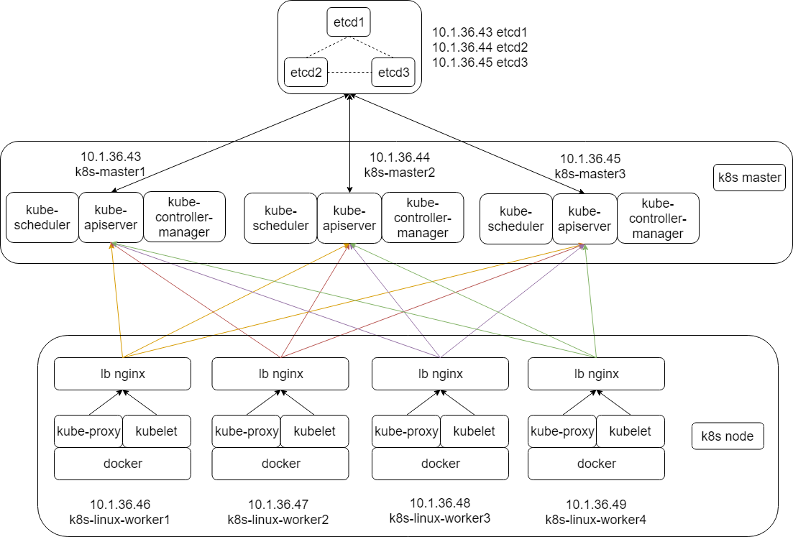

# kubernetes

### kubernetes 架构设计

### kubernetes 各组件的作用

参考
* 《Kubernetes in Action中文版》第十一章

### Kubernetes 中 Pod 的创建流程

参考
* [学习笔记](./Kubetnetes_pod.md)

### Kubetnetes 的预选策略(predicate)和优选策略(priority)

参考
* [学习笔记](./Kubetnetes_pod.md)

### Kubetnetes 高级调度
1. Taints 和 Tolerations（ 污点和容忍）
2. nodeAffinity 节点亲缘性
3. Pod Affinity pod 亲缘性

参考
* 《Kubernetes in Action中文版》第十六章
* [链接一](https://www.cnblogs.com/breezey/p/9101666.html)
* [链接二](https://www.cnblogs.com/breezey/p/9101675.html)
* [链接三](https://www.cnblogs.com/breezey/p/9101677.html)
* [学习笔记](./Kubetnetes_pod.md)

### kubernetes service

参考
* 《Kubernetes in Action中文版》第五章

### kubernetes 网络相关
1. Kubernets 集群 IP，在部署 K8S 集群时需要指定的 IP 地址
2. cni plugins
3. flannel 详细测试过程，vxlan 和 host-gw 的区别
4. 在 k8s 中部署 flannel

参考
* [~~学习笔记~~](./kubernets_network.md)

### CNI 插件基本使用方法

1. CNI 插件基本使用方法
2. 使用 CNI 插件后为什么还需要使用 flannel、calico 等类似第三方插件

参考
* [K8S cni和网络方案](https://sq.163yun.com/blog/article/226877250389852160)
* [CNI 插件基本使用方法](./use_CNI_to_setup_network.md)
* [K8S cni和网络方案](./pdf/K8S_cni_network.pdf)

### kubernetes 认证和授权方式

参考

* [使用kubectl访问Kubernetes集群时的身份验证和授权](https://tonybai.com/2018/06/14/the-authentication-and-authorization-of-kubectl-when-accessing-k8s-cluster/)
* [Kubernetes 默认 User、Group、Service Account](./default_user_group.md)
* 《Kubernetes in Action中文版》第十二章
* [kubectl_Kubernetes](./pdf/kubectl_Kubernetes.pdf)

### kubernetes ssl 认证

参考

* [学习笔记](./kubernetes_ssl.md)

### cfssl 配置选项含义

参考

* [学习笔记](./cfssl.md)

### 二进制部署 k8s 集群

1. cfssl 相关工具使用方法
2. Linux 模块相关操作
3. Linux 内核参数设置方法
4. etcd 集群部署

参考

* [集群架构](./k8s_ansible/kubernetes_install.md)
* [详细操作过程](./install.md)
* [ansible 部署集群的方法](https://github.com/gjmzj/kubeasz)

### Kubernetes DNS

1. 服务发现
2. kube-dns and CoreDNS

参考

* [kube-dns and CoreDNS](./dns/dns-01.md)
* [how to deploy CoreDNS in Kubernetes](./dns/dns-02.md)
* [部署 CoreDNS 和相关测试](./dns/dns-03.md)
* [搭建Kubernetes集群时DNS无法解析问题的处理过程](./dns/k8s_dns.pdf)
* [K8s DNS 策略](./dns/Kubernetes_DNS.pdf)
* 《Wireshark网络分析就这么简单》DNS 小科普
* [阮一峰 DNS 原理入门](http://www.ruanyifeng.com/blog/2016/06/dns.html)
* CoreDNS 原理

### Kubernetes资源限制

参考
* [深入理解Kubernetes资源限制：内存](pdf/Kuberneter_memory.pdf)
* 《Kubernetes in Action中文版》第十四章

后续整理

find . -name '*.pdf'

