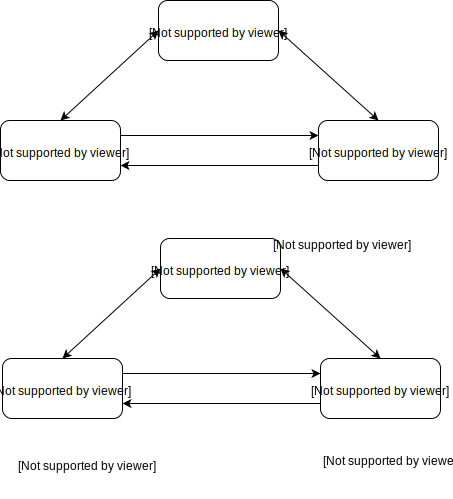
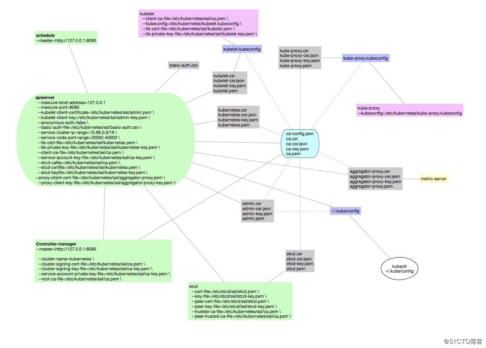

## kubernetes ssl 认证

### 认证方式

kubernetes 采用双向 ssl 认证的方式，如下图所示



### kubernetes 通信



* 客户端（kubectl，serviceAccount，kubelet，kube-proxy，metric-server） -> apiserver
* apiserver -> etcd
* etcd 集群内部

### ssl 证书配置文件说明

```bash
[root@k8s-master1 ssl]# cat ./kubernetes-csr.json
{
  "CN": "kubernetes",  # 用户名（预定义 system:node:<ip>）
  "hosts": [  # 可以访问的地址
    "127.0.0.1",
    "10.1.36.43",
    "10.1.36.44",
    "10.1.36.45",
    "10.68.0.2",
    "kubernetes",
    "kubernetes.default",
    "kubernetes.default.svc",
    "kubernetes.default.svc.cluster",
    "kubernetes.default.svc.cluster.local"
  ],
  "key": {
    "algo": "rsa",
    "size": 2048
  },
  "names": [
    {
      "C": "CN",
      "ST": "hubeisheng",
      "L": "wuhanshi",
      "O": "k8s",  # 用户组（预定义 system:masters、system:nodes）
      "OU": "System"
    }
  ]
}
[root@k8s-master1 ssl]# 

```