## Kubernets Network

### Kubernets 集群 IP

Kubernets 集群 IP 分类如下：

* Node IP：节点设备的 IP，如物理机，虚拟机等容器宿主的实际 IP。

* Pod IP：Pod 的 IP 地址，是根据 docker0 网络 IP 段进行分配的。

* Cluster IP：Service 的 IP，是一个虚拟 IP，仅作用于 service 对象，由 K8S 管理和分配，需要结合 service port 才能使用，单独的 IP 没有通信功能，集群外访问需要一些修改。

在部署 K8S 集群时指定下列 IP 地址：

```
# 集群网络插件，可以支持calico, flannel, kube-router, cilium
CLUSTER_NETWORK="flannel"

######## Cluster IP ########

# 服务网段 (Service CIDR），也就是 Cluster IP，注意不要与内网已有网段冲突
SERVICE_CIDR="10.68.0.0/16"

# kubernetes 服务 IP (预分配，一般是 SERVICE_CIDR 中第一个IP)
CLUSTER_KUBERNETES_SVC_IP="10.68.0.1"

# 集群 DNS 服务 IP (从 SERVICE_CIDR 中预分配)
CLUSTER_DNS_SVC_IP="10.68.0.2"

######## Pod IP ########

# POD 网段 (Cluster CIDR），注意不要与内网已有网段冲突
CLUSTER_CIDR="172.20.0.0/16"

# 服务端口范围 (NodePort Range)
NODE_PORT_RANGE="20000-40000"
```


### 群网络插件，可以支持 calico、flannel、kube-router、cilium

[https://github.com/containernetworking/plugins/releases](https://github.com/containernetworking/plugins/releases)
```bash
# cni plugins download
$ wget https://github.com/containernetworking/plugins/releases/download/v0.7.5/cni-plugins-amd64-v0.7.5.tgz
$ tar -zxvf cni-plugins-amd64-v0.7.5.tgz 
$ ll
total 65720
-rwxr-xr-x. 1 root root  4028260 Mar 16 01:25 bridge
-rw-r--r--. 1 root root 17109361 Mar 16 01:35 cni-plugins-amd64-v0.7.5.tgz
-rwxr-xr-x. 1 root root 10232415 Mar 16 01:26 dhcp
-rwxr-xr-x. 1 root root  2856252 Mar 16 01:25 flannel
-rwxr-xr-x. 1 root root  3127363 Mar 16 01:25 host-device
-rwxr-xr-x. 1 root root  3036768 Mar 16 01:26 host-local
-rwxr-xr-x. 1 root root  3572685 Mar 16 01:26 ipvlan
-rwxr-xr-x. 1 root root  3084347 Mar 16 01:26 loopback
-rwxr-xr-x. 1 root root  3613497 Mar 16 01:26 macvlan
-rwxr-xr-x. 1 root root  3551125 Mar 16 01:25 portmap
-rwxr-xr-x. 1 root root  3993428 Mar 16 01:26 ptp
-rwxr-xr-x. 1 root root  2641877 Mar 16 01:26 sample
-rwxr-xr-x. 1 root root  2850029 Mar 16 01:25 tuning
-rwxr-xr-x. 1 root root  3568537 Mar 16 01:26 vlan

```

### calico

```bash
wget https://github.com/projectcalico/calico/releases/download/v3.7.0/release-v3.7.0.tgz

```

### flannel

[coreos/flannel](https://github.com/coreos/flannel)

#### flannel 原理

**数据包如何在主机间转发是由 flannel 的 backend 实现的。 flannel 提供多种 backend，主要有 vxlan 和 host-gw。**

下图所示主要是 vxlan 原理。



#### flannel 测试

测试 vxlan 步骤如下：

1. 安装 etcd
2. 安装 flannel
3. 配置 docker 链接 flannel

```bash
######## 安装 etcd ########
# 安装 etcd
$ yum install etcd.x86_64
$ rpm -ql etcd.x86_64 0:3.3.11-2.el7.centos
/etc/etcd
/etc/etcd/etcd.conf
/usr/bin/etcd
/usr/bin/etcdctl
/usr/lib/systemd/system/etcd.service

$ systemctl start etcd.service

# 测试 etcd 服务
$ etcdctl --endpoints=http://127.0.0.1:2379 set foo "bar"
bar
$ etcdctl --endpoints=http://127.0.0.1:2379 get foo
bar


######## 安装 flannel ########
# flannel 配置文件
$ cat flannel-config.json
{
  "Network": "10.2.0.0/16",
  "SubnetLen": 24,
  "Backend": {
    "Type": "vxlan"
  }
}

# 将 flannel 配置选项写入 etcd 
$ etcdctl --endpoints=http://127.0.0.1:2379 set /docker-test/network/config < ./flannel-config.json
{
  "Network": "10.2.0.0/16",
  "SubnetLen": 24,
  "Backend": {
    "Type": "vxlan"
  }
}

$ etcdctl --endpoints=http://127.0.0.1:2379 get /docker-test/network/config
{
  "Network": "10.2.0.0/16",
  "SubnetLen": 24,
  "Backend": {
    "Type": "vxlan"
  }
}

$ wget https://github.com/coreos/flannel/releases/download/v0.11.0/flannel-v0.11.0-linux-amd64.tar.gz

$ ll
total 43780
-rwxr-xr-x. 1 root root 35249016 Jan 29 03:46 flanneld
-rw-r--r--. 1 root root  9565743 Jan 29 03:59 flannel-v0.11.0-linux-amd64.tar.gz
-rwxr-xr-x. 1 root root     2139 Oct 23  2018 mk-docker-opts.sh
-rw-r--r--. 1 root root     4300 Oct 23  2018 README.md

# 启动 flannel 服务
$ ./flanneld -etcd-endpoints=http://127.0.0.1:2379 -iface=enp0s3 -etcd-prefix=/docker-test/network

# 启动 flannel 服务后新增 flannel.1 网络接口
$ ip address 
flannel.1 10.2.40.0/32

# 启动 flannel 服务后新增 10.2.0.0/16 的路由，经过 10.2.0.0/16 网段的流量通过 flannel.1 网络接口
$ ip route
10.2.0.0/16 dev flannel.1

######## 配置 docker 链接 flannel ########

# 修改 dockerd 配置文件，新增 --bip 和 --mtu 选项，--bip 和 --mtu 选项的值要与 /run/flannel/subnet.env 文件内容一致
$ cat /etc/docker/daemon.json
{
    "bip": "10.2.40.1/24",
    "mtu": 1450
}

$ cat /run/flannel/subnet.env
FLANNEL_NETWORK=10.2.0.0/16
FLANNEL_SUBNET=10.2.40.1/24
FLANNEL_MTU=1450
FLANNEL_IPMASQ=false

# 重启 dockerd 服务
$ systemctl restart docker.service

# docker0 接口从 10.2.40.1/24 获取 IP
$ ip address show docker0
4: docker0: <NO-CARRIER,BROADCAST,MULTICAST,UP> mtu 1500 qdisc noqueue state DOWN group default 
    link/ether 02:42:e3:75:60:1d brd ff:ff:ff:ff:ff:ff
    inet 10.2.40.1/24 brd 10.2.40.255 scope global docker0
       valid_lft forever preferred_lft forever

```

flannel 的 vxlan 总结：

1. flannel 没有创建新的 docker 网络，而是直接使用 docker 默认的 bridge 网络
2. 同一主机的容器通过 docker0 通信
3. 不同主机的容器通过 flannel.1 转发
4. flannel 的 vxlan 网络配置如下



flannel 的 host-gw 与 vxlan 的异同点：

1. 配置 flannel 使用 host-gw 只要修改 flannel 配置文件如下，其他配置和操作和 vxlan 一样
```bash
# flannel 配置文件
$ cat flannel-config.json
{
  "Network": "10.2.0.0/16",
  "SubnetLen": 24,
  "Backend": {
    "Type": "host-gw"
  }
}
```
2. host-gw 为每个子网都添加了相应的路由
3. host-gw 不需要封包和解包 vxlan



#### 在 k8s 集群中安装 flannel 

```bash

# ---------附加参数--------------------
#默认二进制文件目录
bin_dir="/opt/kube/bin"

#证书目录
ca_dir="/etc/kubernetes/ssl"

#部署目录，即 ansible 工作目录，建议不要修改
base_dir="/etc/ansible"


# 在 work 节点创建相关目录
$ mkdir -p /opt/kube/kube-system/flannel

# 配置 flannel DaemonSet yaml 文件
$ vim /opt/kube/kube-system/flannel/kube-flannel.yaml

# 创建 flannel cni 相关目录
mkdir -p /etc/cni/net.d /opt/kube/images

# 下载 flannel cni plugins
# https://github.com/containernetworking/plugins/releases/download/v0.7.5/cni-plugins-amd64-v0.7.5.tgz
$ scp /etc/ansible/bin/{bridge, flannel, host-local, loopback, portmap} /opt/kube/bin/

# 推送离线 flannel docker 镜像（若执行失败，可忽略）
$ src /etc/ansible/down/pause_3.1.tar /opt/kube/images/pause_3.1.tar
$ src /etc/ansible/down/flannel_v0.11.0-amd64.tar /opt/kube/images/flannel_v0.11.0-amd64.tar

# 导入 flannel 的离线镜像（若执行失败，可忽略）
$ /opt/kube/bin/docker load -i /opt/kube/images/pause_3.1.tar
$ /opt/kube/bin/docker load -i /opt/kube/images/flannel_v0.11.0-amd64.tar  # 导出后的镜像名称是 jmgao1983/flannel:v0.11.0-amd64

# 运行 flannel 网络
$ /opt/kube/bin/kubectl apply -f /opt/kube/kube-system/flannel/ && sleep 5

# 删除默认 cni 配置
rm -rf /etc/cni/net.d/10-default.conf

# 检查 flannel pod 是否运行
/opt/kube/bin/kubectl get pod -n kube-system -o wide

```

#### 配置 flannel DaemonSet yaml 文件 /opt/kube/kube-system/flannel/kube-flannel.yaml 内容如下：
```
---
kind: ClusterRole
apiVersion: rbac.authorization.k8s.io/v1beta1
metadata:
  name: flannel
rules:
  - apiGroups:
      - ""
    resources:
      - pods
    verbs:
      - get
  - apiGroups:
      - ""
    resources:
      - nodes
    verbs:
      - list
      - watch
  - apiGroups:
      - ""
    resources:
      - nodes/status
    verbs:
      - patch
---
kind: ClusterRoleBinding
apiVersion: rbac.authorization.k8s.io/v1beta1
metadata:
  name: flannel
roleRef:
  apiGroup: rbac.authorization.k8s.io
  kind: ClusterRole
  name: flannel
subjects:
- kind: ServiceAccount
  name: flannel
  namespace: kube-system
---
apiVersion: v1
kind: ServiceAccount
metadata:
  name: flannel
  namespace: kube-system
---
kind: ConfigMap
apiVersion: v1
metadata:
  name: kube-flannel-cfg
  namespace: kube-system
  labels:
    tier: node
    app: flannel
data:
  cni-conf.json: |
    {
      "name": "cbr0",
      "plugins": [
        {
          "type": "flannel",
          "delegate": {
            "hairpinMode": true,
            "isDefaultGateway": true
          }
        },
        {
          "type": "portmap",
          "capabilities": {
            "portMappings": true
          }
        }
      ]
    }
  net-conf.json: |
    {
      "Network": "172.20.0.0/16",
      "Backend": {
        "Type": "vxlan"
      }
    }
---
apiVersion: extensions/v1beta1
kind: DaemonSet
metadata:
  name: kube-flannel-ds-amd64
  namespace: kube-system
  labels:
    tier: node
    app: flannel
spec:
  template:
    metadata:
      labels:
        tier: node
        app: flannel
    spec:
      hostNetwork: true
      nodeSelector:
        beta.kubernetes.io/arch: amd64
      tolerations:
      - operator: Exists
        effect: NoSchedule
      serviceAccountName: flannel
      initContainers:
      - name: install-cni
        image: jmgao1983/flannel:v0.11.0-amd64
        command:
        - cp
        args:
        - -f
        - /etc/kube-flannel/cni-conf.json
        - /etc/cni/net.d/10-flannel.conflist
        volumeMounts:
        - name: cni
          mountPath: /etc/cni/net.d
        - name: flannel-cfg
          mountPath: /etc/kube-flannel/
      containers:
      - name: kube-flannel
        image: jmgao1983/flannel:v0.11.0-amd64
        command:
        - /opt/bin/flanneld
        args:
        - --ip-masq
        - --kube-subnet-mgr
        resources:
          requests:
            cpu: "100m"
            memory: "50Mi"
          limits:
            cpu: "100m"
            memory: "50Mi"
        securityContext:
          privileged: true
        env:
        - name: POD_NAME
          valueFrom:
            fieldRef:
              fieldPath: metadata.name
        - name: POD_NAMESPACE
          valueFrom:
            fieldRef:
              fieldPath: metadata.namespace

        # if hosts have multiple net interfaces, set following two ENVs
        - name: KUBERNETES_SERVICE_HOST
          value: "192.168.1.12"
          #value: "{{ KUBE_APISERVER.split(':')[1].lstrip('/') }}"
        - name: KUBERNETES_SERVICE_PORT
          value: "8443"

        volumeMounts:
        - name: run
          mountPath: /run
        - name: flannel-cfg
          mountPath: /etc/kube-flannel/
      volumes:
        - name: run
          hostPath:
            path: /run
        - name: cni
          hostPath:
            path: /etc/cni/net.d
        - name: flannel-cfg
          configMap:
            name: kube-flannel-cfg

```

#### 官方 yaml 文件

[kube-flannel.yml](https://raw.githubusercontent.com/coreos/flannel/a70459be0084506e4ec919aa1c114638878db11b/Documentation/kube-flannel.yml)

note：

在 k8s 中安装 flannel 插件采用官方使用的部署 DaemonSet 资源的方式。

官方 DaemonSet 资源的 yaml 文件说明如下：

* 定义了 ClusterRole、ClusterRoleBinding、ServiceAccount、ConfigMap、DaemonSet 五种资源

```
{
  "name": "cbr0",
  "plugins": [
    {
      "type": "flannel",
      "delegate": {
        "hairpinMode": true,
        "isDefaultGateway": true
      }
    },
    {
      "type": "portmap",
      "capabilities": {
        "portMappings": true
      }
    }
  ]
}
```

* flannel 配置是

```
{
  "Network": "10.244.0.0/16",
  "Backend": {
    "Type": "vxlan"
  }
}
```

* 在容器中执行的指令是 ** flanneld --ip-masq --kube-subnet-mgr **

```
flanneld 
-ip-masq  setup IP masquerade rule for traffic destined outside of overlay network 为覆盖网络外部的流量设置IP伪装规则
-kube-subnet-mgr  contact the Kubernetes API for subnet assignment instead of etcd.  联系Kubernetes API以进行子网分配而不是etcd。
```

* 定义了五个 DaemonSet 资源，分别对应不同的 CPU 架构，五中不同的 CPU 架构分别是：amd64、arm64、arm、ppc64le、s390x

* 五个 DaemonSet 资源使用不同的 name、image 和 nodeSelector: beta.kubernetes.io/arch

* 五个 DaemonSet 资源有如下的不同

```
name: kube-flannel-ds-amd64
nodeSelector:  beta.kubernetes.io/arch: amd64
image: quay.io/coreos/flannel:v0.11.0-amd64

name: kube-flannel-ds-arm64
nodeSelector:  beta.kubernetes.io/arch: arm64
image: quay.io/coreos/flannel:v0.11.0-arm64

name: kube-flannel-ds-arm
nodeSelector:  beta.kubernetes.io/arch: arm
image: quay.io/coreos/flannel:v0.11.0-arm

name: kube-flannel-ds-ppc64le
nodeSelector:  beta.kubernetes.io/arch: ppc64le
image: quay.io/coreos/flannel:v0.11.0-ppc64le

name: kube-flannel-ds-s390x
nodeSelector:  beta.kubernetes.io/arch: s390x
image: quay.io/coreos/flannel:v0.11.0-s390x
```


* 使用 nodeSelector: beta.kubernetes.io/arch 选择不同的 CPU 架构，因此需要为节点打上 beta.kubernetes.io/arch 标签，在实际操作中也可以只定义存在的 CPU 架构
为了尽快部署成功，需要提前把相关镜像下载导入

* 整个 yaml 文件定义如下

```
---
kind: ClusterRole
apiVersion: rbac.authorization.k8s.io/v1beta1
metadata:
  name: flannel
rules:
  - apiGroups:
      - ""
    resources:
      - pods
    verbs:
      - get
  - apiGroups:
      - ""
    resources:
      - nodes
    verbs:
      - list
      - watch
  - apiGroups:
      - ""
    resources:
      - nodes/status
    verbs:
      - patch
---
kind: ClusterRoleBinding
apiVersion: rbac.authorization.k8s.io/v1beta1
metadata:
  name: flannel
roleRef:
  apiGroup: rbac.authorization.k8s.io
  kind: ClusterRole
  name: flannel
subjects:
- kind: ServiceAccount
  name: flannel
  namespace: kube-system
---
apiVersion: v1
kind: ServiceAccount
metadata:
  name: flannel
  namespace: kube-system
---
kind: ConfigMap
apiVersion: v1
metadata:
  name: kube-flannel-cfg
  namespace: kube-system
  labels:
    tier: node
    app: flannel
data:
  cni-conf.json: |
    {
      "name": "cbr0",
      "plugins": [
        {
          "type": "flannel",
          "delegate": {
            "hairpinMode": true,
            "isDefaultGateway": true
          }
        },
        {
          "type": "portmap",
          "capabilities": {
            "portMappings": true
          }
        }
      ]
    }
  net-conf.json: |
    {
      "Network": "10.244.0.0/16",
      "Backend": {
        "Type": "vxlan"
      }
    }
---
apiVersion: extensions/v1beta1
kind: DaemonSet
metadata:
  name: kube-flannel-ds-amd64
  namespace: kube-system
  labels:
    tier: node
    app: flannel
spec:
  template:
    metadata:
      labels:
        tier: node
        app: flannel
    spec:
      hostNetwork: true
      nodeSelector:
        beta.kubernetes.io/arch: amd64
      tolerations:
      - operator: Exists
        effect: NoSchedule
      serviceAccountName: flannel
      initContainers:
      - name: install-cni
        image: quay.io/coreos/flannel:v0.11.0-amd64
        command:
        - cp
        args:
        - -f
        - /etc/kube-flannel/cni-conf.json
        - /etc/cni/net.d/10-flannel.conflist
        volumeMounts:
        - name: cni
          mountPath: /etc/cni/net.d
        - name: flannel-cfg
          mountPath: /etc/kube-flannel/
      containers:
      - name: kube-flannel
        image: quay.io/coreos/flannel:v0.11.0-amd64
        command:
        - /opt/bin/flanneld
        args:
        - --ip-masq
        - --kube-subnet-mgr
        resources:
          requests:
            cpu: "100m"
            memory: "50Mi"
          limits:
            cpu: "100m"
            memory: "50Mi"
        securityContext:
          privileged: true
        env:
        - name: POD_NAME
          valueFrom:
            fieldRef:
              fieldPath: metadata.name
        - name: POD_NAMESPACE
          valueFrom:
            fieldRef:
              fieldPath: metadata.namespace
        volumeMounts:
        - name: run
          mountPath: /run
        - name: flannel-cfg
          mountPath: /etc/kube-flannel/
      volumes:
        - name: run
          hostPath:
            path: /run
        - name: cni
          hostPath:
            path: /etc/cni/net.d
        - name: flannel-cfg
          configMap:
            name: kube-flannel-cfg
---
apiVersion: extensions/v1beta1
kind: DaemonSet
metadata:
  name: kube-flannel-ds-arm64
  namespace: kube-system
  labels:
    tier: node
    app: flannel
spec:
  template:
    metadata:
      labels:
        tier: node
        app: flannel
    spec:
      hostNetwork: true
      nodeSelector:
        beta.kubernetes.io/arch: arm64
      tolerations:
      - operator: Exists
        effect: NoSchedule
      serviceAccountName: flannel
      initContainers:
      - name: install-cni
        image: quay.io/coreos/flannel:v0.11.0-arm64
        command:
        - cp
        args:
        - -f
        - /etc/kube-flannel/cni-conf.json
        - /etc/cni/net.d/10-flannel.conflist
        volumeMounts:
        - name: cni
          mountPath: /etc/cni/net.d
        - name: flannel-cfg
          mountPath: /etc/kube-flannel/
      containers:
      - name: kube-flannel
        image: quay.io/coreos/flannel:v0.11.0-arm64
        command:
        - /opt/bin/flanneld
        args:
        - --ip-masq
        - --kube-subnet-mgr
        resources:
          requests:
            cpu: "100m"
            memory: "50Mi"
          limits:
            cpu: "100m"
            memory: "50Mi"
        securityContext:
          privileged: true
        env:
        - name: POD_NAME
          valueFrom:
            fieldRef:
              fieldPath: metadata.name
        - name: POD_NAMESPACE
          valueFrom:
            fieldRef:
              fieldPath: metadata.namespace
        volumeMounts:
        - name: run
          mountPath: /run
        - name: flannel-cfg
          mountPath: /etc/kube-flannel/
      volumes:
        - name: run
          hostPath:
            path: /run
        - name: cni
          hostPath:
            path: /etc/cni/net.d
        - name: flannel-cfg
          configMap:
            name: kube-flannel-cfg
---
apiVersion: extensions/v1beta1
kind: DaemonSet
metadata:
  name: kube-flannel-ds-arm
  namespace: kube-system
  labels:
    tier: node
    app: flannel
spec:
  template:
    metadata:
      labels:
        tier: node
        app: flannel
    spec:
      hostNetwork: true
      nodeSelector:
        beta.kubernetes.io/arch: arm
      tolerations:
      - operator: Exists
        effect: NoSchedule
      serviceAccountName: flannel
      initContainers:
      - name: install-cni
        image: quay.io/coreos/flannel:v0.11.0-arm
        command:
        - cp
        args:
        - -f
        - /etc/kube-flannel/cni-conf.json
        - /etc/cni/net.d/10-flannel.conflist
        volumeMounts:
        - name: cni
          mountPath: /etc/cni/net.d
        - name: flannel-cfg
          mountPath: /etc/kube-flannel/
      containers:
      - name: kube-flannel
        image: quay.io/coreos/flannel:v0.11.0-arm
        command:
        - /opt/bin/flanneld
        args:
        - --ip-masq
        - --kube-subnet-mgr
        resources:
          requests:
            cpu: "100m"
            memory: "50Mi"
          limits:
            cpu: "100m"
            memory: "50Mi"
        securityContext:
          privileged: true
        env:
        - name: POD_NAME
          valueFrom:
            fieldRef:
              fieldPath: metadata.name
        - name: POD_NAMESPACE
          valueFrom:
            fieldRef:
              fieldPath: metadata.namespace
        volumeMounts:
        - name: run
          mountPath: /run
        - name: flannel-cfg
          mountPath: /etc/kube-flannel/
      volumes:
        - name: run
          hostPath:
            path: /run
        - name: cni
          hostPath:
            path: /etc/cni/net.d
        - name: flannel-cfg
          configMap:
            name: kube-flannel-cfg
---
apiVersion: extensions/v1beta1
kind: DaemonSet
metadata:
  name: kube-flannel-ds-ppc64le
  namespace: kube-system
  labels:
    tier: node
    app: flannel
spec:
  template:
    metadata:
      labels:
        tier: node
        app: flannel
    spec:
      hostNetwork: true
      nodeSelector:
        beta.kubernetes.io/arch: ppc64le
      tolerations:
      - operator: Exists
        effect: NoSchedule
      serviceAccountName: flannel
      initContainers:
      - name: install-cni
        image: quay.io/coreos/flannel:v0.11.0-ppc64le
        command:
        - cp
        args:
        - -f
        - /etc/kube-flannel/cni-conf.json
        - /etc/cni/net.d/10-flannel.conflist
        volumeMounts:
        - name: cni
          mountPath: /etc/cni/net.d
        - name: flannel-cfg
          mountPath: /etc/kube-flannel/
      containers:
      - name: kube-flannel
        image: quay.io/coreos/flannel:v0.11.0-ppc64le
        command:
        - /opt/bin/flanneld
        args:
        - --ip-masq
        - --kube-subnet-mgr
        resources:
          requests:
            cpu: "100m"
            memory: "50Mi"
          limits:
            cpu: "100m"
            memory: "50Mi"
        securityContext:
          privileged: true
        env:
        - name: POD_NAME
          valueFrom:
            fieldRef:
              fieldPath: metadata.name
        - name: POD_NAMESPACE
          valueFrom:
            fieldRef:
              fieldPath: metadata.namespace
        volumeMounts:
        - name: run
          mountPath: /run
        - name: flannel-cfg
          mountPath: /etc/kube-flannel/
      volumes:
        - name: run
          hostPath:
            path: /run
        - name: cni
          hostPath:
            path: /etc/cni/net.d
        - name: flannel-cfg
          configMap:
            name: kube-flannel-cfg
---
apiVersion: extensions/v1beta1
kind: DaemonSet
metadata:
  name: kube-flannel-ds-s390x
  namespace: kube-system
  labels:
    tier: node
    app: flannel
spec:
  template:
    metadata:
      labels:
        tier: node
        app: flannel
    spec:
      hostNetwork: true
      nodeSelector:
        beta.kubernetes.io/arch: s390x
      tolerations:
      - operator: Exists
        effect: NoSchedule
      serviceAccountName: flannel
      initContainers:
      - name: install-cni
        image: quay.io/coreos/flannel:v0.11.0-s390x
        command:
        - cp
        args:
        - -f
        - /etc/kube-flannel/cni-conf.json
        - /etc/cni/net.d/10-flannel.conflist
        volumeMounts:
        - name: cni
          mountPath: /etc/cni/net.d
        - name: flannel-cfg
          mountPath: /etc/kube-flannel/
      containers:
      - name: kube-flannel
        image: quay.io/coreos/flannel:v0.11.0-s390x
        command:
        - /opt/bin/flanneld
        args:
        - --ip-masq
        - --kube-subnet-mgr
        resources:
          requests:
            cpu: "100m"
            memory: "50Mi"
          limits:
            cpu: "100m"
            memory: "50Mi"
        securityContext:
          privileged: true
        env:
        - name: POD_NAME
          valueFrom:
            fieldRef:
              fieldPath: metadata.name
        - name: POD_NAMESPACE
          valueFrom:
            fieldRef:
              fieldPath: metadata.namespace
        volumeMounts:
        - name: run
          mountPath: /run
        - name: flannel-cfg
          mountPath: /etc/kube-flannel/
      volumes:
        - name: run
          hostPath:
            path: /run
        - name: cni
          hostPath:
            path: /etc/cni/net.d
        - name: flannel-cfg
          configMap:
            name: kube-flannel-cfg
```

#### flannel 服务

```bash
$ yum install flannel.x86_64
$ rpm -ql flannel-0.7.1-4.el7.x86_64
/etc/sysconfig/flanneld
/run/flannel
/usr/bin/flanneld
/usr/bin/flanneld-start
/usr/lib/systemd/system/docker.service.d/flannel.conf
/usr/lib/systemd/system/flanneld.service
/usr/lib/tmpfiles.d/flannel.conf
/usr/libexec/flannel
/usr/libexec/flannel/mk-docker-opts.sh
/usr/share/doc/flannel-0.7.1

# /usr/bin/flanneld-start 和 /usr/bin/flanneld 是一模一样的文件，都是 flannel 的二进制执行文件

$ cat /usr/lib/systemd/system/flanneld.service
[Unit]
Description=Flanneld overlay address etcd agent
After=network.target
After=network-online.target
Wants=network-online.target
After=etcd.service
Before=docker.service
# etcd.service -> flanneld.service -> docker.service

[Service]
Type=notify
EnvironmentFile=/etc/sysconfig/flanneld
EnvironmentFile=-/etc/sysconfig/docker-network
ExecStart=/usr/bin/flanneld-start $FLANNEL_OPTIONS
ExecStartPost=/usr/libexec/flannel/mk-docker-opts.sh -k DOCKER_NETWORK_OPTIONS -d /run/flannel/docker
Restart=on-failure

[Install]
WantedBy=multi-user.target
WantedBy=docker.service
$


$ cat /etc/sysconfig/flanneld
# Flanneld configuration options  

# etcd url location.  Point this to the server where etcd runs
FLANNEL_ETCD_ENDPOINTS="http://127.0.0.1:2379"

# etcd config key.  This is the configuration key that flannel queries
# For address range assignment
FLANNEL_ETCD_PREFIX="/atomic.io/network"
# 需要提前将 flannel 配置信息写入 etcd
# etcdctl --endpoints=http://127.0.0.1:2379 set /atomic.io/network/config < ./flannel-config.json

# Any additional options that you want to pass
#FLANNEL_OPTIONS=""
 
$

$ cat /usr/libexec/flannel/mk-docker-opts.sh
#!/bin/sh

# /usr/libexec/flannel/mk-docker-opts.sh -k DOCKER_NETWORK_OPTIONS -d /run/flannel/docker

usage() {
	echo "$0 [-f FLANNEL-ENV-FILE] [-d DOCKER-ENV-FILE] [-i] [-c] [-m] [-k COMBINED-KEY]

Generate Docker daemon options based on flannel env file
OPTIONS:
	-f	Path to flannel env file. Defaults to /run/flannel/subnet.env
	-d	Path to Docker env file to write to. Defaults to /run/docker_opts.env
	-i	Output each Docker option as individual var. e.g. DOCKER_OPT_MTU=1500
	-c	Output combined Docker options into DOCKER_OPTS var
	-k	Set the combined options key to this value (default DOCKER_OPTS=)
	-m	Do not output --ip-masq (useful for older Docker version)
" >&2

	exit 1
}

# flanneld 服务启动后将相关参数写入 /run/flannel/subnet.env 文件中
# mk-docker-opts.sh 从 /run/flannel/subnet.env 读取相关参数后构造成启动 docker 的参数
# 将构造好的参数写入 /run/docker_opts.env 文件中，启动 docker 之前要将 /run/docker_opts.env 文件中的内容添加到 docker 配置文件中
flannel_env="/run/flannel/subnet.env"
docker_env="/run/docker_opts.env"  # /run/flannel/docker
combined_opts_key="DOCKER_OPTS"  # DOCKER_NETWORK_OPTIONS
indiv_opts=false
combined_opts=false
ipmasq=true

while getopts "f:d:icmk:?h" opt; do
	case $opt in
		f)
			flannel_env=$OPTARG
			;;
		d)
			docker_env=$OPTARG
			;;
		i)
			indiv_opts=true
			;;
		c)
			combined_opts=true
			;;
		m)
			ipmasq=false
			;;
		k)
			combined_opts_key=$OPTARG
			;;
		[\?h])
			usage
			;;
	esac
done

if [ $indiv_opts = false ] && [ $combined_opts = false ]; then
	indiv_opts=true
	combined_opts=true
fi

if [ -f "$flannel_env" ]; then
	. $flannel_env
fi

if [ -n "$FLANNEL_SUBNET" ]; then
	DOCKER_OPT_BIP="--bip=$FLANNEL_SUBNET"
fi

if [ -n "$FLANNEL_MTU" ]; then
	DOCKER_OPT_MTU="--mtu=$FLANNEL_MTU"
fi

if [ -n "$FLANNEL_IPMASQ" ] && [ $ipmasq = true ] ; then
	if [ "$FLANNEL_IPMASQ" = true ] ; then
		DOCKER_OPT_IPMASQ="--ip-masq=false"
	elif [ "$FLANNEL_IPMASQ" = false ] ; then
		DOCKER_OPT_IPMASQ="--ip-masq=true"
	else
		echo "Invalid value of FLANNEL_IPMASQ: $FLANNEL_IPMASQ" >&2
		exit 1
	fi
fi

eval docker_opts="\$${combined_opts_key}"

if [ "$docker_opts" ]; then
	docker_opts="$docker_opts ";
fi

echo -n "" >$docker_env

for opt in $(set | grep "DOCKER_OPT_"); do

	OPT_NAME=$(echo $opt | awk -F "=" '{print $1;}');
	OPT_VALUE=$(eval echo "\$$OPT_NAME");

	if [ "$indiv_opts" = true ]; then
		echo "$OPT_NAME=\"$OPT_VALUE\"" >>$docker_env;
	fi

	docker_opts="$docker_opts $OPT_VALUE";

done

if [ "$combined_opts" = true ]; then
	echo "${combined_opts_key}=\"${docker_opts}\"" >>$docker_env
fi

```

####

```bash
[root@localhost ~]# ifconfig -a
enp0s3: flags=4163<UP,BROADCAST,RUNNING,MULTICAST>  mtu 1500
        inet 10.0.2.15  netmask 255.255.255.0  broadcast 10.0.2.255
        inet6 fe80::b005:7b80:ddd1:5832  prefixlen 64  scopeid 0x20<link>
        ether 08:00:27:f5:0a:d1  txqueuelen 1000  (Ethernet)
        RX packets 99870  bytes 81260524 (77.4 MiB)
        RX errors 0  dropped 0  overruns 0  frame 0
        TX packets 47617  bytes 3574225 (3.4 MiB)
        TX errors 0  dropped 0 overruns 0  carrier 0  collisions 0

lo: flags=73<UP,LOOPBACK,RUNNING>  mtu 65536
        inet 127.0.0.1  netmask 255.0.0.0
        inet6 ::1  prefixlen 128  scopeid 0x10<host>
        loop  txqueuelen 1000  (Local Loopback)
        RX packets 4  bytes 328 (328.0 B)
        RX errors 0  dropped 0  overruns 0  frame 0
        TX packets 4  bytes 328 (328.0 B)
        TX errors 0  dropped 0 overruns 0  carrier 0  collisions 0

[root@localhost ~]# 
[root@localhost ~]# route -n
Kernel IP routing table
Destination     Gateway         Genmask         Flags Metric Ref    Use Iface
0.0.0.0         10.0.2.2        0.0.0.0         UG    100    0        0 enp0s3
10.0.2.0        0.0.0.0         255.255.255.0   U     100    0        0 enp0s3
[root@localhost ~]# 
[root@localhost ~]# 

[root@localhost work]# cat flannel-config.json
{
  "Network": "10.2.0.0/16",
  "SubnetLen": 24,
  "Backend": {
    "Type": "vxlan"
  }
}
[root@localhost work]# 
[root@localhost work]# systemctl status flanneld.service
● flanneld.service - Flanneld overlay address etcd agent
   Loaded: loaded (/usr/lib/systemd/system/flanneld.service; disabled; vendor preset: disabled)
   Active: inactive (dead)
[root@localhost work]# systemctl start flanneld.service
[root@localhost work]# 
[root@localhost work]# systemctl status flanneld.service
● flanneld.service - Flanneld overlay address etcd agent
   Loaded: loaded (/usr/lib/systemd/system/flanneld.service; disabled; vendor preset: disabled)
   Active: active (running) since Thu 2019-05-09 14:13:41 CST; 2s ago
  Process: 1841 ExecStartPost=/usr/libexec/flannel/mk-docker-opts.sh -k DOCKER_NETWORK_OPTIONS -d /run/flannel/docker (code=exited, status=0/SUCCESS)
 Main PID: 1829 (flanneld)
   CGroup: /system.slice/flanneld.service
           └─1829 /usr/bin/flanneld -etcd-endpoints=http://127.0.0.1:2379 -etcd-prefix=/atomic.io/network

May 09 14:13:41 localhost.localdomain systemd[1]: Starting Flanneld overlay address etcd agent...
May 09 14:13:41 localhost.localdomain flanneld-start[1829]: I0509 14:13:41.453690    1829 main.go:132] Installing signal handlers
May 09 14:13:41 localhost.localdomain flanneld-start[1829]: I0509 14:13:41.455044    1829 manager.go:136] Determining IP address of default interface
May 09 14:13:41 localhost.localdomain flanneld-start[1829]: I0509 14:13:41.455488    1829 manager.go:149] Using interface with name enp0s3 and address 10.0.2.15
May 09 14:13:41 localhost.localdomain flanneld-start[1829]: I0509 14:13:41.455500    1829 manager.go:166] Defaulting external address to interface address (10.0.2.15)
May 09 14:13:41 localhost.localdomain flanneld-start[1829]: I0509 14:13:41.522953    1829 local_manager.go:179] Picking subnet in range 10.2.1.0 ... 10.2.255.0
May 09 14:13:41 localhost.localdomain flanneld-start[1829]: I0509 14:13:41.525797    1829 manager.go:250] Lease acquired: 10.2.26.0/24
May 09 14:13:41 localhost.localdomain flanneld-start[1829]: I0509 14:13:41.526259    1829 network.go:58] Watching for L3 misses
May 09 14:13:41 localhost.localdomain flanneld-start[1829]: I0509 14:13:41.526270    1829 network.go:66] Watching for new subnet leases
May 09 14:13:41 localhost.localdomain systemd[1]: Started Flanneld overlay address etcd agent.
[root@localhost work]# 


[root@localhost work]# ifconfig -a
enp0s3: flags=4163<UP,BROADCAST,RUNNING,MULTICAST>  mtu 1500
        inet 10.0.2.15  netmask 255.255.255.0  broadcast 10.0.2.255
        inet6 fe80::b005:7b80:ddd1:5832  prefixlen 64  scopeid 0x20<link>
        ether 08:00:27:f5:0a:d1  txqueuelen 1000  (Ethernet)
        RX packets 126170  bytes 101011795 (96.3 MiB)
        RX errors 0  dropped 0  overruns 0  frame 0
        TX packets 60903  bytes 4544850 (4.3 MiB)
        TX errors 0  dropped 0 overruns 0  carrier 0  collisions 0

flannel.1: flags=4163<UP,BROADCAST,RUNNING,MULTICAST>  mtu 1450
        inet 10.2.26.0  netmask 255.255.255.255  broadcast 0.0.0.0
        inet6 fe80::2cb0:4ff:fe35:158  prefixlen 64  scopeid 0x20<link>
        ether 2e:b0:04:35:01:58  txqueuelen 0  (Ethernet)
        RX packets 0  bytes 0 (0.0 B)
        RX errors 0  dropped 0  overruns 0  frame 0
        TX packets 0  bytes 0 (0.0 B)
        TX errors 0  dropped 8 overruns 0  carrier 0  collisions 0

lo: flags=73<UP,LOOPBACK,RUNNING>  mtu 65536
        inet 127.0.0.1  netmask 255.0.0.0
        inet6 ::1  prefixlen 128  scopeid 0x10<host>
        loop  txqueuelen 1000  (Local Loopback)
        RX packets 170  bytes 17794 (17.3 KiB)
        RX errors 0  dropped 0  overruns 0  frame 0
        TX packets 170  bytes 17794 (17.3 KiB)
        TX errors 0  dropped 0 overruns 0  carrier 0  collisions 0

[root@localhost work]# 
[root@localhost work]# route -n
Kernel IP routing table
Destination     Gateway         Genmask         Flags Metric Ref    Use Iface
0.0.0.0         10.0.2.2        0.0.0.0         UG    100    0        0 enp0s3
10.0.2.0        0.0.0.0         255.255.255.0   U     100    0        0 enp0s3
10.2.0.0        0.0.0.0         255.255.0.0     U     0      0        0 flannel.1
[root@localhost work]# 
[root@localhost work]# cat /run/flannel/subnet.env
FLANNEL_NETWORK=10.2.0.0/16
FLANNEL_SUBNET=10.2.26.1/24
FLANNEL_MTU=1450
FLANNEL_IPMASQ=false
[root@localhost work]# 
[root@localhost work]# cat /run/flannel/docker
DOCKER_OPT_BIP="--bip=10.2.26.1/24"
DOCKER_OPT_IPMASQ="--ip-masq=true"
DOCKER_OPT_MTU="--mtu=1450"
DOCKER_NETWORK_OPTIONS=" --bip=10.2.26.1/24 --ip-masq=true --mtu=1450"
[root@localhost work]# 
[root@localhost work]# cat /etc/docker/daemon.json
{
  "bip": "10.2.26.1/24",
  "ip-masq": true,
  "mtu": 1450
}
[root@localhost work]# 
[root@localhost work]# systemctl start docker.service
[root@localhost work]# ifconfig -a
docker0: flags=4099<UP,BROADCAST,MULTICAST>  mtu 1500
        inet 10.2.26.1  netmask 255.255.255.0  broadcast 10.2.26.255
        ether 02:42:02:aa:a5:8b  txqueuelen 0  (Ethernet)
        RX packets 0  bytes 0 (0.0 B)
        RX errors 0  dropped 0  overruns 0  frame 0
        TX packets 0  bytes 0 (0.0 B)
        TX errors 0  dropped 0 overruns 0  carrier 0  collisions 0

enp0s3: flags=4163<UP,BROADCAST,RUNNING,MULTICAST>  mtu 1500
        inet 10.0.2.15  netmask 255.255.255.0  broadcast 10.0.2.255
        inet6 fe80::b005:7b80:ddd1:5832  prefixlen 64  scopeid 0x20<link>
        ether 08:00:27:f5:0a:d1  txqueuelen 1000  (Ethernet)
        RX packets 231221  bytes 188811785 (180.0 MiB)
        RX errors 0  dropped 0  overruns 0  frame 0
        TX packets 108008  bytes 8272908 (7.8 MiB)
        TX errors 0  dropped 0 overruns 0  carrier 0  collisions 0

flannel.1: flags=4163<UP,BROADCAST,RUNNING,MULTICAST>  mtu 1450
        inet 10.2.26.0  netmask 255.255.255.255  broadcast 0.0.0.0
        inet6 fe80::2cb0:4ff:fe35:158  prefixlen 64  scopeid 0x20<link>
        ether 2e:b0:04:35:01:58  txqueuelen 0  (Ethernet)
        RX packets 0  bytes 0 (0.0 B)
        RX errors 0  dropped 0  overruns 0  frame 0
        TX packets 0  bytes 0 (0.0 B)
        TX errors 0  dropped 8 overruns 0  carrier 0  collisions 0

lo: flags=73<UP,LOOPBACK,RUNNING>  mtu 65536
        inet 127.0.0.1  netmask 255.0.0.0
        inet6 ::1  prefixlen 128  scopeid 0x10<host>
        loop  txqueuelen 1000  (Local Loopback)
        RX packets 898  bytes 55650 (54.3 KiB)
        RX errors 0  dropped 0  overruns 0  frame 0
        TX packets 898  bytes 55650 (54.3 KiB)
        TX errors 0  dropped 0 overruns 0  carrier 0  collisions 0

[root@localhost work]# 
[root@localhost work]# route -n
Kernel IP routing table
Destination     Gateway         Genmask         Flags Metric Ref    Use Iface
0.0.0.0         10.0.2.2        0.0.0.0         UG    100    0        0 enp0s3
10.0.2.0        0.0.0.0         255.255.255.0   U     100    0        0 enp0s3
10.2.0.0        0.0.0.0         255.255.0.0     U     0      0        0 flannel.1
10.2.26.0       0.0.0.0         255.255.255.0   U     0      0        0 docker0
[root@localhost work]# ip route 
default via 10.0.2.2 dev enp0s3 proto dhcp metric 100 
10.0.2.0/24 dev enp0s3 proto kernel scope link src 10.0.2.15 metric 100 
10.2.0.0/16 dev flannel.1 
10.2.26.0/24 dev docker0 proto kernel scope link src 10.2.26.1 
[root@localhost work]# 


```


### kube-router

[kube-router](https://github.com/cloudnativelabs/kube-router)

```bash
# 下载cni plugins
bridge
host-local
loopback
portmap

# Dockerfile
FROM alpine:3.9

RUN apk add --no-cache \
      iptables \
      ip6tables \
      ipset \
      iproute2 \
      ipvsadm \
      conntrack-tools \
      curl \
      bash && \
    mkdir -p /var/lib/gobgp && \
    mkdir -p /usr/local/share/bash-completion && \
    curl -L -o /usr/local/share/bash-completion/bash-completion \
        https://raw.githubusercontent.com/scop/bash-completion/master/bash_completion

ADD build/image-assets/bashrc /root/.bashrc
ADD build/image-assets/profile /root/.profile
ADD build/image-assets/vimrc /root/.vimrc
ADD build/image-assets/motd-kube-router.sh /etc/motd-kube-router.sh
ADD kube-router gobgp /usr/local/bin/
RUN cd && \
    /usr/local/bin/gobgp --gen-cmpl --bash-cmpl-file /var/lib/gobgp/gobgp-completion.bash

WORKDIR "/root"
ENTRYPOINT ["/usr/local/bin/kube-router"]


```

### cilium