# Kubernetes 101 – Networking

One of the reasons that I’m so interested in docker and it’s associated technologies is because of the new networking paradigm it brings along with it. Kubernetes has a unique (and pretty awesome) way of dealing with these networking challenges but it can be hard to understand at first glance. My goal in this post is to walk you through deploying a couple of Kubernetes constructs and analyze what Kubernetes is doing at the network layer to make it happen. That being said, let’s start with the basics of deploying a pod. We’ll be using the lab we created in the [first post](https://www.dasblinkenlichten.com/kubernetes-101-the-build/) and some of the config file examples we created in the [second post](https://www.dasblinkenlichten.com/kubernetes-101-the-constructs/).  我对docker及其相关技术如此感兴趣的原因之一是因为它带来了新的网络范例。 Kubernetes具有应对这些网络挑战的独特（且非常出色）的方式，但是乍一看可能很难理解。 我在这篇文章中的目标是引导您逐步部署几个Kubernetes构造，并分析Kubernetes在网络层正在做的事情，以实现这一目标。 话虽如此，让我们从部署Pod的基础开始。 我们将使用在第一篇文章中创建的实验以及在第二篇文章中创建的一些配置文件示例。

*Note: I should point out here again that this lab is built with bare metal hardware. The network model in this type of lab is likely slightly different that what you’d see with a cloud provider. However, the mechanics behind what Kubernetes is doing from a network perspective should be identical.*   注意：我应该在这里再次指出该实验室是使用裸机硬件构建的。 这种类型的实验室中的网络模型可能与您在云提供商处看到的网络模型稍有不同。 但是，从网络角度来看，Kubernetes所做的工作背后的机制应该是相同的。

So just to level set, here is what our lab looks like…


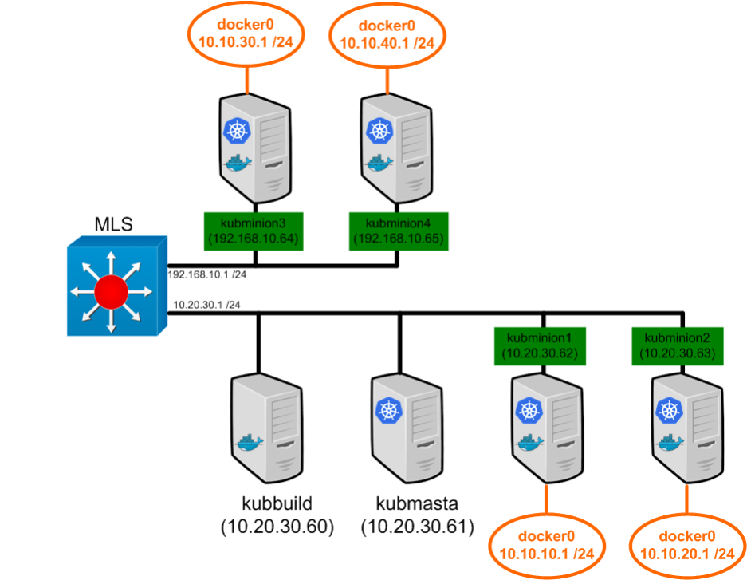


We touched on the topic of pod IP addressing before, but let’s provide some background so that we’re all on the same page. The Kubernetes network model dictates that the containers off each Kubernetes node should be routable. Recall that the default docker network mode provides a docker0 bridge with IP address in the 172.17.0.0/16 range. Each container will get an IP out of this subnet and use the docker0 bridge IP (172.17.42.1) as it’s default gateway. The catch is that the network doesn’t need to know about 172.17.0.0/16 or how to get to it since the docker host does a IP masquerade (or hide NAT) behind it’s real NIC’s IP address for any traffic sourced from a container. That is, the network would see any container traffic as coming from the docker nodes physical IP address.  我们之前已经谈到了Pod IP寻址的主题，但是让我们提供一些背景知识，以便使我们都在同一页面上。 Kubernetes网络模型指示每个Kubernetes节点附近的容器应该是可路由的。 回想一下，默认docker网络模式提供了docker0网桥，其IP地址在172.17.0.0/16范围内。 每个容器将从该子网中获取一个IP，并使用docker0网桥IP（172.17.42.1）作为其默认网关。 问题是网络不需要知道172.17.0.0/16或如何访问网络，因为Docker主机对真实NIC的IP地址进行了IP伪装（或隐藏NAT），以应对来自容器的任何流量 。 也就是说，网络将看到来自Docker节点物理IP地址的任何容器流量。

*Note: When I use the work ‘network’ in this post I’m almost always referring to the physical network that connects the hosts together.*   注意：在本文中使用“网络”一词时，我几乎总是指将主机连接在一起的物理网络。

While this makes sense from an ease of use perspective, it’s not really ideal. That model requires all sorts of port mapping and in general sort of limits the ability of the docker host. In the Kubernetes model, the docker0 bridge on each host is routable on the network. That is, when a pod get’s deployed, a host outside of the cluster can access that pod directly rather than through a port mapping on the physical host. With that being said, you can view the Kubernetes nodes as routers from a network perspective. If we changed our lab diagram to a network diagram it might look more like this…  尽管从易用性的角度来看这是有道理的，但这并不是很理想。 该模型需要各种端口映射，并且通常会限制Docker主机的能力。 在Kubernetes模型中，每个主机上的docker0网桥可在网络上路由。 也就是说，部署Pod时，群集外部的主机可以直接访问该Pod，而无需通过物理主机上的端口映射。 话虽如此，您可以从网络角度将Kubernetes节点视为路由器。 如果我们将实验室图更改为网络图，它可能看起来更像这样……

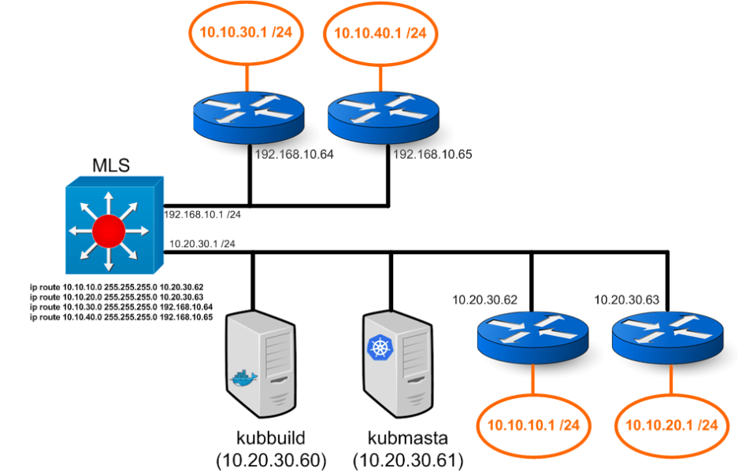

The multilayer switch (MLS) has two layer 3 segments hanging off of it. One supporting the 10.20.30.0/24 network and the other supporting the 192.168.10.0 /24 network. In addition, it has routes on it that tell it how to get to each of the subnets that hang off of the routers (Kubernetes nodes). This also means that containers generated on any node will use the node (docker0 bridge IP) as their default gateway, and the node in turn uses the MLS as it’s default gateway. I’m sort of beating the crap out of this concept but it’s important. Network guys LIKE layer 3 to the edge.  多层交换机（MLS）悬挂有两个第3层网段。 一个支持10.20.30.0/24网络，另一个支持192.168.10.0 / 24网络。 另外，它上面有路由，告诉它如何到达挂在路由器（Kubernetes节点）上的每个子网。 这也意味着在任何节点上生成的容器将使用该节点（docker0网桥IP）作为其默认网关，而该节点又将MLS用作其默认网关。 我有点不喜欢这个概念，但这很重要。 网络专家喜欢第3层到边缘。

So now let’s move onto some examples and see what Kubernetes does on the networking side of things during different circumstances…  现在，让我们来看一些示例，看看Kubernetes在不同情况下在网络方面的作用……

**Deploying a pod
**We did this in the last post, but let’s do it again and pay closer attention to what happens. Let’s take our pod example from the last post and use it again…

```
id: "webpod"
kind: "Pod"
apiVersion: "v1beta1"
desiredState:
  manifest:
    version: "v1beta1"
    id: "webpod"
    containers:
      - name: "webpod80"
        image: "jonlangemak/docker:web_container_80"
        cpu: 100
        ports:
          - containerPort: 80
            hostPort: 80
      - name: "webpod8080"
        image: "jonlangemak/docker:web_container_8080"
        cpu: 100
        ports:
          - containerPort: 8080
            hostPort: 8080
labels:
  name: "web"
```

Let’s also assume we’re working with a blank slate on the master. I’ve cleaned up any of the replication controllers, pods, and other services that we had used in the previous post…  还要假设我们正在处理母版上的空白面板。 我已经清理了上一篇文章中使用的任何复制控制器，pod和其他服务…

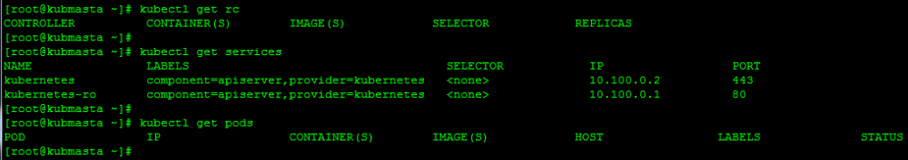

So let’s go check out one of the nodes and see what it has running at this point. Let’s just pick kubminion1 for now…

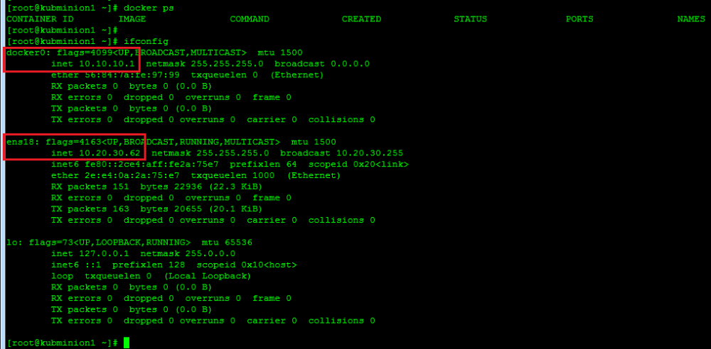

So no containers running yet and I just want to point out the network configuration is as expected. We have a docker0 bridge interface and the minions local IP interface. Let’s head back to the master, deploy our pod from the config above, and see what happens…  因此尚无容器在运行，我只想指出网络配置符合预期。 我们有一个docker0桥接接口和minions本地IP接口。 让我们回到主节点，通过上面的配置部署我们的pod，看看会发生什么……

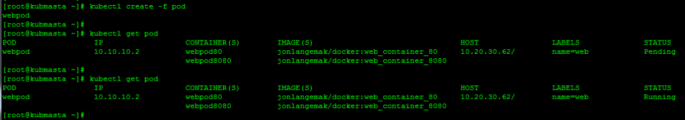

So a couple of interesting things happened already. Kubernetes has assigned a host of 10.20.30.62 (kubminion1) for this pod to run on. Notice that the pod also has an IP address assigned to it which happens to be within the docker0 bridge allocation for kubminion1. Let’s pop over to kubminion1 and see what’s going on…  因此，已经发生了一些有趣的事情。 Kubernetes已经为该Pod分配了主机10.20.30.62（kubminion1）。 请注意，该容器还分配了一个IP地址，该地址恰好在kubminion1的docker0网桥分配中。 让我们跳到kubminion1，看看发生了什么……

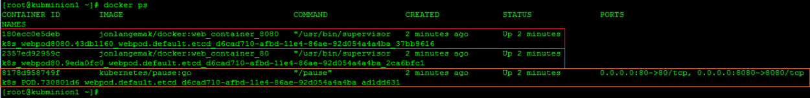

Kubminion1 now has 3 containers running. Our pod specification only defines 2, so where does the third one come from? The third containers is running and image called ‘kubernetes/pause:go’. Notice how this is the container that has the ports mapped to it as well. So why is that? Let’s take a deeper look at the containers to see why. I’m going to use the docker ‘inspect’ command to look at some of the information of each container. Namely, I want to see what network mode each container is deployed in…  Kubminion1现在有3个容器在运行。 我们的广告连播规范仅定义2，那么第三个来自何处？ 第三个容器正在运行，映像名为“ kubernetes/pause：go”。 请注意，这也是具有映射端口的容器。 那为什么呢？ 让我们更深入地研究容器，以了解原因。 我将使用docker'inspect'命令查看每个容器的某些信息。 即，我想查看每个容器以什么网络模式部署…

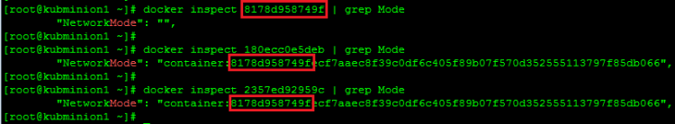

Interesting, so if we check the ‘NetworkMode’ of each container we see an interesting configuration. The first container we inspected was running the ‘kubernetes/pause:go’ and has a default network mode. The second and third containers we inspected we’re running the ‘web_container_80’ and ‘web_container_8080’ images that we defined in our pods. Note that each of the pod containers has a non-default network config. Specifically, each pod container is using the [mapped container mode](https://www.dasblinkenlichten.com/docker-networking-101-mapped-container/) and specifying the target container as the one running the ‘Kubernetes/pause:go’ image.  有趣的是，如果我们检查每个容器的“ NetworkMode”，就会看到有趣的配置。 我们检查的第一个容器运行的是“ kubernetes/pause：go”，并具有默认的网络模式。 我们检查的第二个和第三个容器正在运行我们在广告连播中定义的“ web_container_80”和“ web_container_8080”图像。 请注意，每个Pod容器都有一个非默认的网络配置。 具体来说，每个吊舱容器都使用映射的容器模式，并将目标容器指定为运行“ Kubernetes/pause：go”映像的容器。

So let’s think about this for a second, why would they do this? First off, all the containers in the pod need to share the same IP address. This makes mapped container mode almost a requirement. However, why don’t they just start the first pod container, and then link the second pod container to the first? I think the answer to that question comes in two pieces. First, linking a pod that has multiple containers could be a pain if you had more than 2. Second, you’re dependant on the first container you linked to. If container 2 is linked to container 1, and container 1 dies, then the network stack on container 2 dies as well. It’s easier (and smarter) to have a very basic container run and link all of the pod containers to it. This also simplifies port mapping as we only ever need to apply port mapping rules to the pause container.  因此，让我们考虑一下，为什么他们会这样做呢？ 首先，吊舱中的所有容器都需要共享相同的IP地址。 这使得映射容器模式几乎是必需的。 但是，为什么不先启动第一个容器，然后将第二个容器链接到第一个容器呢？ 我认为这个问题的答案分为两部分。 首先，如果您拥有多个容器，则链接具有多个容器的Pod可能会很麻烦。其次，您依赖于所链接的第一个容器。 如果将容器2链接到容器1，并且容器1死亡，那么容器2上的网络堆栈也将死亡。 进行基本的容器运行并将所有的pod容器链接到它，变得更容易（也更聪明）。 这也简化了端口映射，因为我们只需要将端口映射规则应用于暂停容器即可。

So our pod network diagram looks like this…

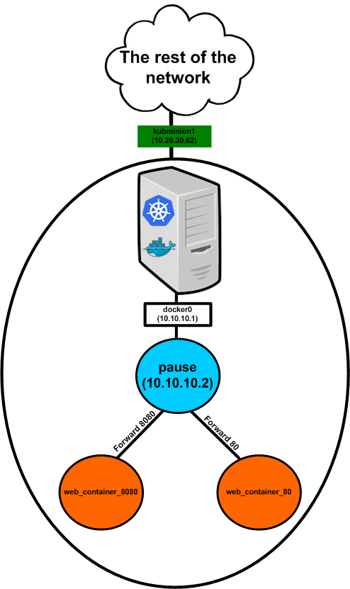

So the real network destination for the pod IP traffic is the pause container. The diagram above is a little deceiving since it shows the pause container ‘forwarding’ the port 80 and port 8080 traffic to the relevant containers. The pause container doesn’t actually do this, it just works that way logically since the two web containers are listening on those ports and share the same network stack with the pause continuer. This is why all of the port mappings for the actual pod containers show up under the port mapping for the pause container. We can examine this with the ‘docker port’ command…  因此，pod IP流量的真正网络目的地是暂停容器。 上图有点欺骗，因为它显示了暂停容器将端口80和端口8080的流量“转发”到相关容器。 暂停容器实际上并不执行此操作，它只是在逻辑上以这种方式工作，因为两个Web容器正在侦听这些端口并与暂停继续器共享同一网络堆栈。 这就是为什么所有实际容器容器的端口映射都显示在暂停容器的端口映射下的原因。 我们可以使用“ docker port”命令对此进行检查...

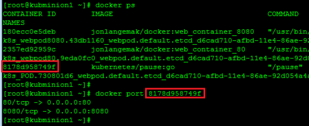

So the pause container really just holds the network endpoint for the pod. It really doesn’t do anything else at all. So what about the node? Does it need to do anything to get the traffic to the pause container? Let’s check the iptables rules and see…  因此，暂停容器实际上只是容纳Pod的网络端点。 它真的什么也没做。 那么节点呢？ 它需要做些什么来使流量到达暂停容器吗？ 让我们检查一下iptables规则，看看...

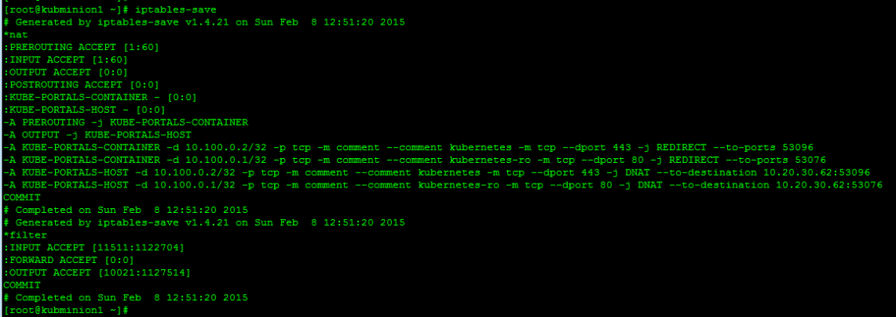

There are some rules here, but none of them apply to the pod we just defined. Like I mentioned in the last post, there are some default services Kubernetes provides by default which will be present on each Kubernetes node. That’s what we’re seeing in the above output. The key piece is that we don’t see any masquerade rules or any inbound port mappings for the pod 10.10.10.2.  这里有一些规则，但是没有一个规则适用于我们刚刚定义的Pod。 就像我在上一篇文章中提到的那样，Kubernetes默认提供一些默认服务，这些服务将出现在每个Kubernetes节点上。 这就是我们在上面的输出中看到的。 关键是我们看不到Pod 10.10.10.2的任何伪装规则或任何入站端口映射。

**Deploying a service
**So now that we’ve seen how Kubernetes handles connecting it’s most basic building block, let’s talk about how it handles services. Like we talked about in our last post, services allow you to abstract services being hosted in pods. In addition, services allow you to scale services horizontally by providing a load balancing mechanism across pods hosting the same service. So let’s once again reset the lab by deleting the pod we just just created and make sure that kubmasta thinks the slate is clean…  现在，我们已经了解了Kubernetes如何处理其最基本的构建块之间的连接，让我们来谈谈它如何处理服务。 就像我们在上一篇文章中讨论的那样，服务使您可以抽象托管在pod中的服务。 此外，服务通过在承载相同服务的Pod之间提供负载平衡机制，使您可以水平扩展服务。 因此，让我们通过删除刚刚创建的Pod再次重置实验室，并确保kubmasta认为此板是干净的…

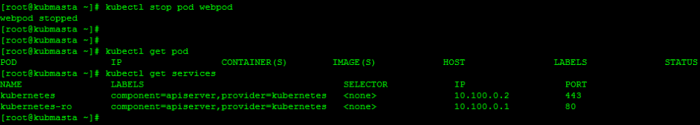Now, let’s take the service we defined in the last post and examine it one more time. Here is the configuration file for the service we had called ‘myfirstservice’…  现在，让我们采用在上一篇文章中定义的服务，并再次进行检查。 这是我们称为“ myfirstservice”的服务的配置文件…

```
  id: "webfrontend"
  kind: "Service"
  apiVersion: "v1beta1"
  port: 80
  containerPort: 80
  selector:
    name: "web"
  labels:
    name: "webservice"
```

To make things a little clearer to explain, I’m going to change the service definition slightly to this…  为了使说明更清晰一些，我将对此稍作更改服务定义…

```
  id: "webfrontend"
  kind: "Service"
  apiVersion: "v1beta1"
  port: 80
  containerPort: 8080
  selector:
    name: "web8080"
  labels:
    name: "webservice"
```

Exact same deal, just changed the container port to be 8080. So let’s define this service in the Kubernetes cluster..  完全一样，只是将容器端口更改为8080。因此，让我们在Kubernetes集群中定义此服务。

*Note: I dont think I mentioned this before but services should be built before pods that match the service selector are deployed. This ensures that the service related environmental variables exist in the containers.*  注意：我之前没有提到过，但是应该在部署与服务选择器匹配的Pod之前构建服务。 这样可以确保与服务相关的环境变量存在于容器中。

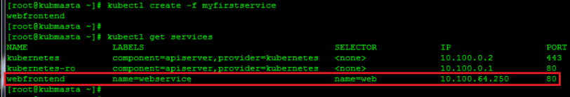
The service creation worked as expected. If we check the available services we see that the cluster has given the service an IP address of 10.100.64.250. This IP address is allocated out of what Kubernetes refers to as the ‘Portal Network’. If you recall, when we built the API service on the kubmasta one of the flags we defined was the ‘PortalNet’…  服务创建按预期工作。 如果我们检查可用的服务，我们会看到群集已将服务的IP地址设置为10.100.64.250。 该IP地址是Kubernetes所谓的“门户网络”分配的。 回想一下，当我们在kubmasta上构建API服务时，我们定义的标志之一就是“ PortalNet”…

```
[Unit]
Description=Kubernetes API Server
After=etcd.service
Wants=etcd.service
[Service]
ExecStart=/opt/kubernetes/kube-apiserver \
--address=0.0.0.0 \
--port=8080 \
--etcd_servers=http://127.0.0.1:4001 \
--portal_net=10.100.0.0/16 \
--logtostderr=true
Restart=on-failure
RestartSec=5

[Install]
WantedBy=multi-user.target
```

This can really be any subnet so long as it doesn’t overlap with the docker0 or physical host subnets. The reason that it can be any subnet is that it’s never routed on the network. The portal net is only locally significant to each node and really just a means to get the traffic off the container and headed towards its default gateway (the docker0 bridge). So before we go any further, let’s again look at kubminion1 and see what’s changed since we defined the service. Let’s start by checking the netfilter rules…  只要不与docker0或物理主机子网重叠，它实际上可以是任何子网。 它可以是任何子网的原因是它从未在网络上路由过。 门户网络仅对每个节点在本地有意义，实际上只是一种使流量脱离容器并流向其默认网关（docker0桥）的方法。 因此，在进一步介绍之前，让我们再次看一下kubminion1，看看自定义服务以来发生了什么变化。 让我们从检查netfilter规则开始...

*Note: I’m talking about the same service as above but the IP address is different. This is an unfortunate side effect of writing this blog over a few days and having to rebuild pieces of the lab in between. Above I refer to the service IP as 10.100.64.250 and below I refer to it as 10.100.87.105. Sorry for the confusion!*  注意：我说的是与上述服务相同，但IP地址不同。 不幸的是，几天后写此博客并不得不在此之间重新构建实验片段，这是一个不幸的副作用。 上面我将服务IP称为10.100.64.250，下面我将其称为10.100.87.105。 对困惑感到抱歉！

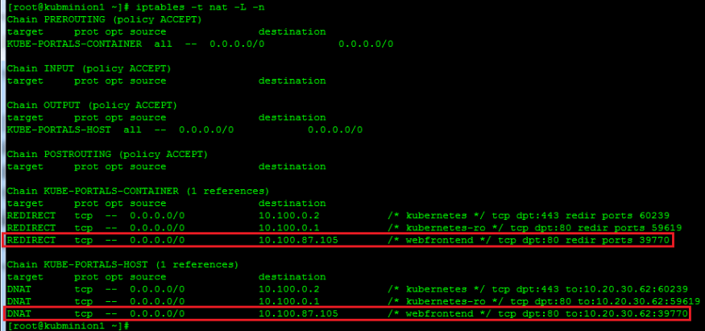

So what do these rules do? The first line tells the host to match a TCP flow destined to 10.100.87.105 on port 80. If it sees a flow that matches that specification, it should redirect the traffic locally to port 39770. The second line tells the node to do the same thing but in a different manner since you’re covering traffic generated from the host rather than the container. The reason the rule isnt identical is because REDIRECT only works for traffic that’s traversing the host. Traffic that’s generated by the host needs to be tackled with a DNAT rule. Long story short, they accomplish the same thing just in different ways so that all traffic coming off the node headed to 10.100.87.105 on port 80 get redirected locally to the host on port 39770.  那么这些规则是做什么的呢？ 第一行告诉主机在端口80上匹配发往10.100.87.105的TCP流。如果看到与该规范匹配的流，则应将流量本地重定向到端口39770。第二行告诉节点执行相同的操作。 事情，但是以不同的方式，因为您要涵盖的是主机而不是容器所产生的流量。 规则不完全相同的原因是，REDIRECT仅适用于穿越主机的流量。 主机产生的流量需要使用DNAT规则来解决。 简而言之，它们以不同的方式完成相同的操作，因此从节点传出的所有流量在端口80上到达10.100.87.105都将本地重定向到端口39770上的主机。

So we know that any traffic destined to the service IP and port will get redirected to the localhost on port 39770. But where does that get us? This is where the kubernetes-proxy service comes into play. The proxy service assigns a random port for a newly created service and creates a load balancing object within the service that listens on that particular port. In this case, the port happened to be 39770. If we would have been watching the logs of the kuberenetes-service on kubminion1 when we created the service, we would have seen log entries like this…  因此，我们知道，发往服务IP和端口的所有流量都将重定向到端口39770上的localhost。但是，从何而来？ 这就是kubernetes-proxy服务发挥作用的地方。 代理服务会为新创建的服务分配一个随机端口，并在服务中创建一个负载平衡对象，以监听该特定端口。 在这种情况下，端口恰好是39770。如果我们在创建服务时一直在看kubminion1上kuberenetes-service的日志，我们会看到这样的日志条目…

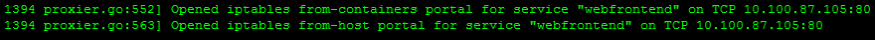

So now that the traffic destined to the service is being redirected to the proxy, we need something for it to load balance to. Let’s spin up one of the replication controllers from our last blog so we can see this in action. I’ll use this config for my replication controller…  因此，现在已将目的地为该服务的流量重定向到代理，我们需要为其提供负载平衡的东西。 让我们从上一个博客中旋转一个复制控制器，以便我们可以实际看到它。 我将这个配置用于我的复制控制器...

```
id: web-controller-2
apiVersion: v1beta1
kind: ReplicationController
desiredState:
  replicas: 4
  replicaSelector:
    name: web8080
  podTemplate:
    desiredState:
      manifest:
        version: v1beta1
        id: webpod
        containers:
          - name: webpod
            image: jonlangemak/docker:web_container_8080
            ports:
              - containerPort: 8080
    labels:
      name: web8080
```

Let’s load this into the cluster and make sure that all of the pods start…

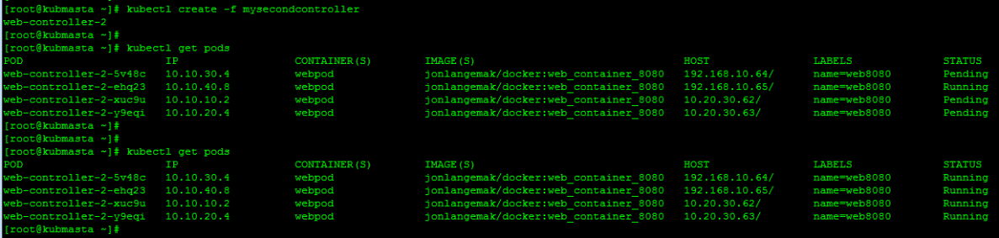
Looks good. So now that we have all the pods running, the service should select pods for load balancing that match the label of ‘web8080’. Since the replication controller selector matches all of the pods with the label of ‘web8080’, we should have 4 pods to load balance against. At this point, I’d argue that our lab looks like this…  看起来不错。 因此，既然我们已经运行了所有Pod，则该服务应选择与标签“ web8080”匹配的Pod以进行负载平衡。 由于复制控制器选择器将所有带有“ web8080”标签的Pod匹配，因此我们应该有4个Pod来进行负载平衡。 在这一点上，我认为我们的实验室看起来像这样……

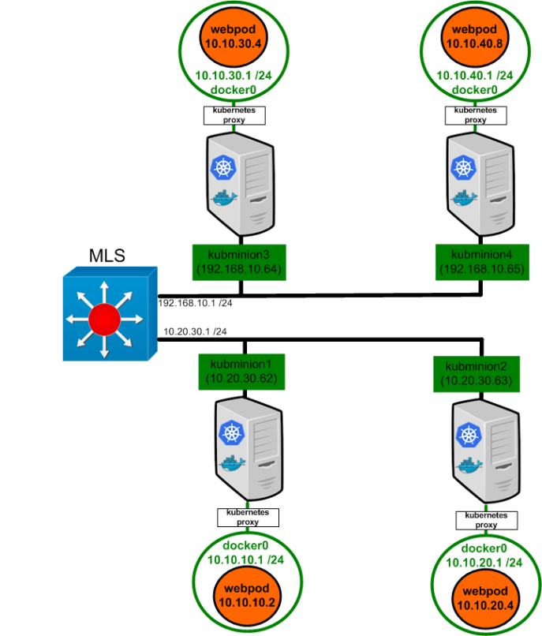

While the Kubernetes proxy has been depicted as a sort of shim, it’s really just another service running on the node. The redirect rules we saw above are what make the Kubernetes proxy a shim for traffic destined to service IP addresses.  尽管Kubernetes代理被描述为一种填充程序，但它实际上只是节点上运行的另一项服务。 我们在上面看到的重定向规则使Kubernetes代理成为发往服务IP地址的流量的填充程序。

To see this in action, we’ll do a series of packet captures using tcpdump. To do this, we need to install tcpdump on kubminion1. Let’s install it with this command…  为了了解这一点，我们将使用tcpdump进行一系列数据包捕获。 为此，我们需要在kubminion1上安装tcpdump。 让我们用此命令安装它...

```
yum -y install tcpdump
```

Once installed, let’s open three SSH sessions to kubminion1. In the first window we’ll run the following tcpdump command…

```
tcpdump -nn -q -i ens18 port 8080
```

*Note: In this case we want to capture packets on the servers physical ethernet interface. In my case, it’s called ‘ens18’.*

In the second window we want to run another tcpdump, but we need to get some more info first. Namely, we want to get the virtual interface (veth) name for the container attached to the docker0 bridge. Running with the assumption that you only have the webpod container running on this host you can do a simple ‘ifconfig’ and you should only have one ‘Veth’ interface…

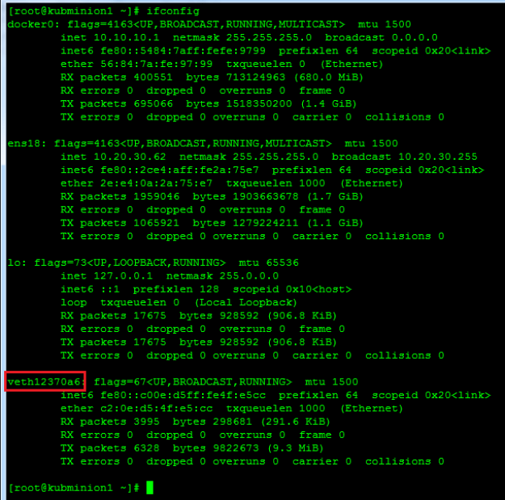

Copy this interface name and insert it into the tcpdump command for your second window…

```
tcpdump -nn -q -i veth12370a6 host 10.100.87.105
```

Run both the commands and stack the windows up so you can see both at the same time…

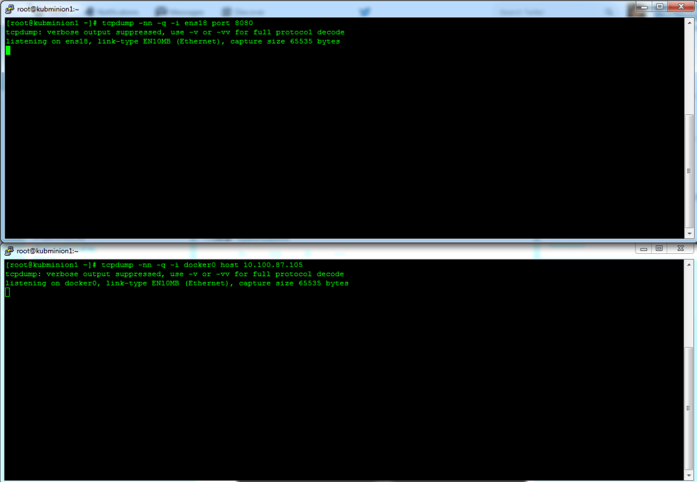

So once you have both captures running let’s turn our attention to the third window. Let’s use our ‘docker exec’ command to attach into the ‘web_container_8080’ container (do a ‘docker ps’ to get the container name first)…  因此，一旦您同时运行了两个捕获，让我们将注意力转移到第三个窗口。 让我们使用“ docker exec”命令将其附加到“ web_container_8080”容器中（执行“ docker ps”首先获取容器名称）…

docker exec -it e130a52dfae6 /bin/bash

Once inside the running container, let’s try and access the service with curl…

```
curl 10.100.87.105
```

After my first curl to the service IP address, I had this in my capture windows…

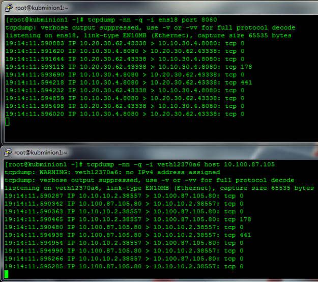

So what does this tell us? Let’s draw this out in our diagram showing the top capture (traffic off the servers physical NIC) in red and the bottom capture (traffic off the docker0 bridge) in blue…  那这告诉我们什么呢？ 让我们在图表中将其绘制出来，以红色显示顶部捕获（从服务器物理NIC传输），以蓝色显示底部捕获（从docker0桥接器传输）。

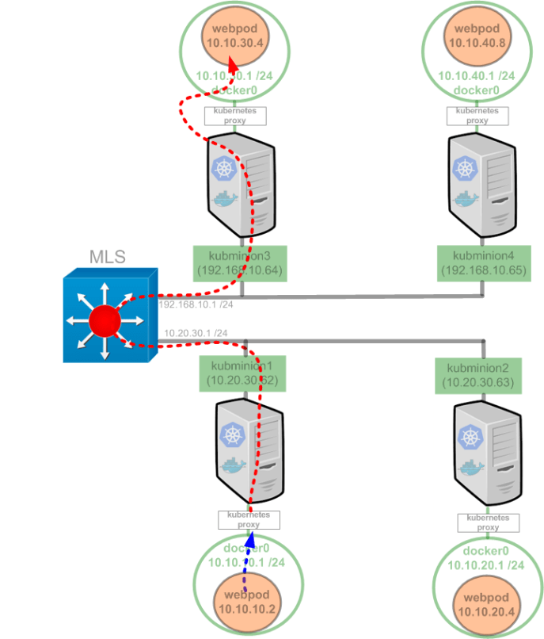

*Note: I make a point to draw the line around the ‘kubernetes proxy’ on kubminion3. I did this because the kubernetes proxy on kubminion3 is NOT required for this flow to work. Put another way, the proxy service that intercepts the service request talks directly to the pod it load balances to.*  注意：我想在kubminion3上的“ kubernetes代理”周围画一条线。 我这样做是因为不需要kubminion3上的kubernetes代理才能使此流程正常工作。 换句话说，拦截服务请求的代理服务直接与其负载平衡的Pod通信。

So if we look at the bottom window first, we see the traffic from the container point of view. The container attempts to open a TCP socket to 10.100.87.105 on port 80. We see return traffic from the service IP address of 10.100.87.105. From the container’s point of view, it’s entire communication is with the service. If we look at our second capture (top window) we can see what actually hit the wire. We see a TCP session sourced from the nodes physical IP address (10.20.30.62) and destined to the pod hosted on kubminion3 (10.10.30.4). To summarize, the Kubernetes proxy service is acting as a full proxy maintaining two distinct TCP connections. The first from container to proxy, and the second from proxy to the load balanced destination.  因此，如果我们首先查看底部的窗口，则会从容器的角度看到流量。 容器尝试在端口80上打开到10.100.87.105的TCP套接字。我们看到来自服务IP地址10.100.87.105的返回流量。 从容器的角度来看，整个通信都是与服务进行的。 如果我们查看第二个捕获（顶部窗口），则可以看到实际击中的内容。 我们看到一个TCP会话源自节点的物理IP地址（10.20.30.62），并发往kubminion3（10.10.30.4）上托管的Pod。 总而言之，Kubernetes代理服务充当了维护两个不同TCP连接的完整代理。 第一个从容器到代理，第二个从代理到负载平衡的目标。

If we cleared our captures and ran the curl again we should see the traffic load balanced to another node…

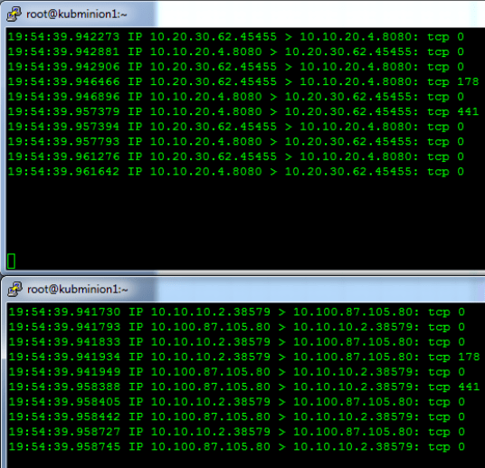

In this case, the Kubernetes proxy decided to load balance the traffic to the pod running on kubminion2 (10.10.20.4). Our diagram for this flow would look like…

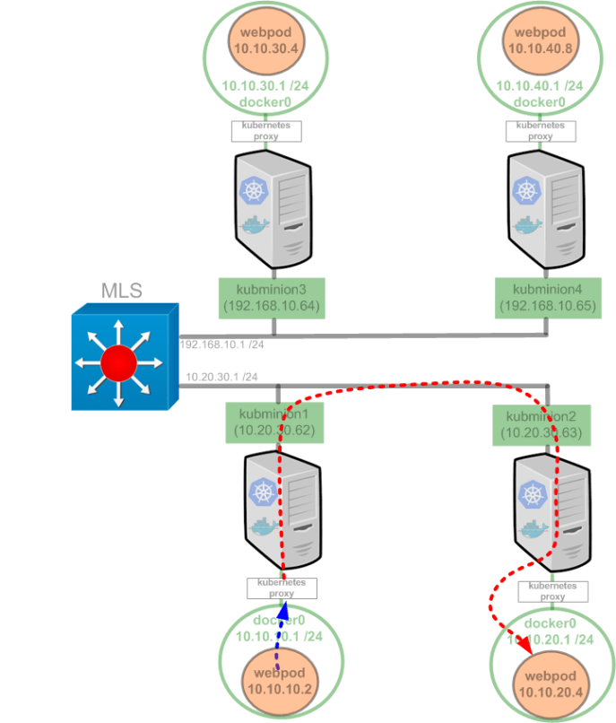

I think you get the point without me showing you the other two possible outcomes for load balancing our test service. The important part to understand about services is that they allow you to easily and quickly scale pod deployed services. One could see how this can be a powerful feature when coupled with pods deployed with a replication controller.

But while services handle an important aspect of a Kubernetes cluster, they’re only relevant for pods accessing services living in other pods. Recall, the portal IP space isn’t accessible from the network, it’s only locally significant to the host. So how do things outside the cluster consume applications deployed in the cluster? We’ll cover that in our next post.

[来源](https://www.dasblinkenlichten.com/kubernetes-101-networking/)