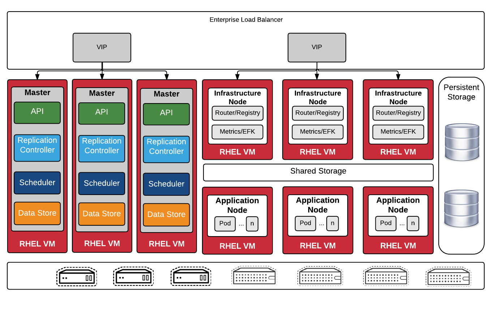
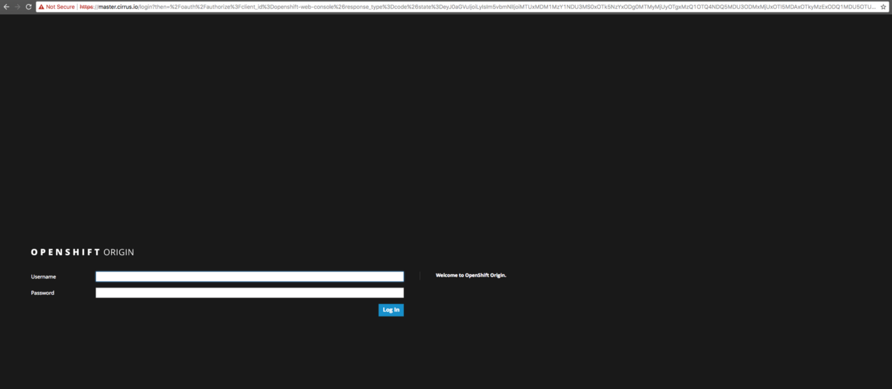
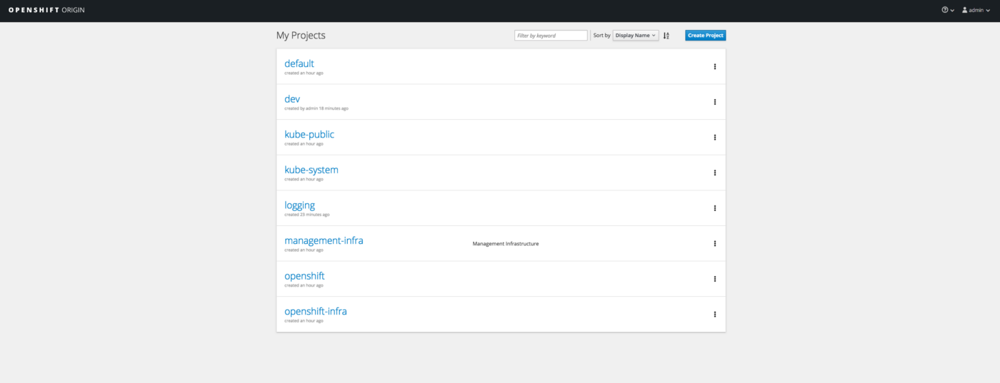
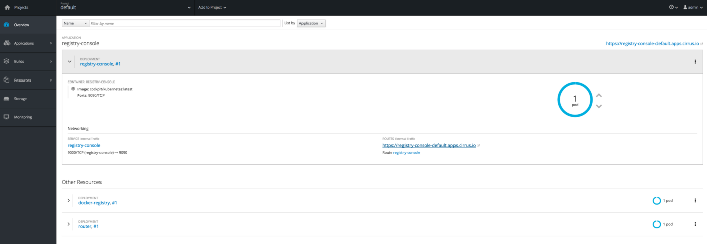
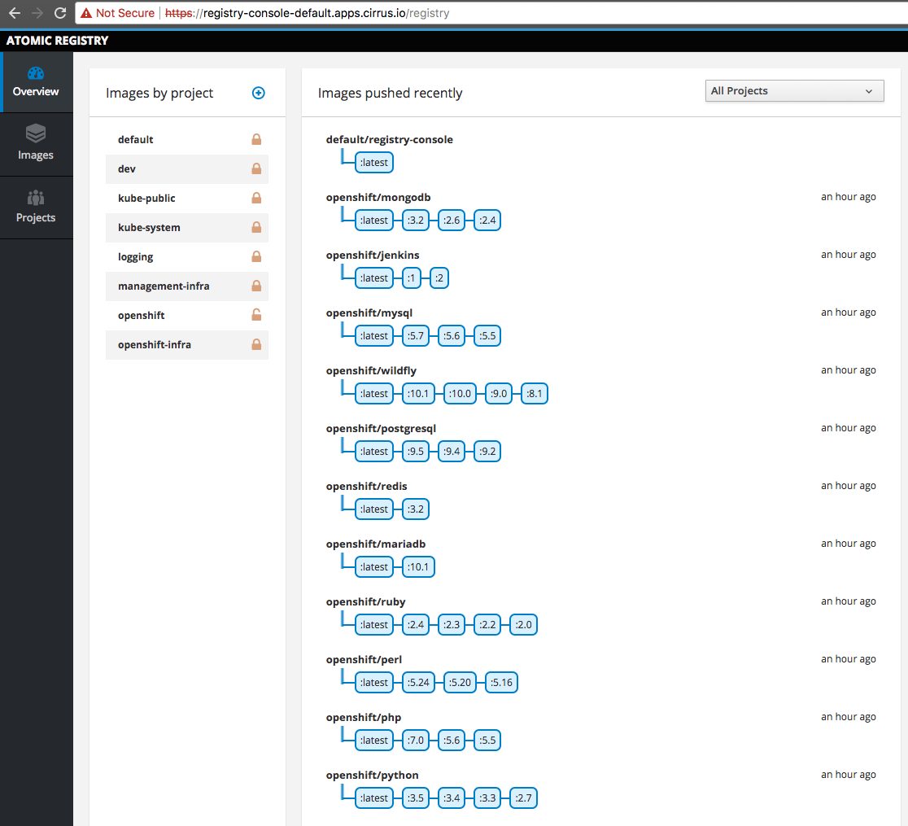

# Installing a Highly-Available OpenShift Origin Cluster

This article proposes a reference architecture for a Highly Available installation of OpenShift Origin. We will outline the architecture of such an installation and walk through the installation process. The intention of this process is to perform iterative installations of the OpenShift Origin cluster.  本文提出了OpenShift Origin的高度可用安装的参考架构。 我们将概述此类安装的体系结构并逐步完成安装过程。 此过程的目的是执行OpenShift Origin集群的迭代安装。

## Cluster Design & Architecture



## Preparation…

### Provision Servers

* 01 Master (Openshift Web Console)

* 01 Infra (Router, Registry, Metrics, EFK)

* 01 Node (Application node POD)

**Centos 7 x86_64** with Minimal Installation.

Each of these servers should be provisioned with an SSH public key which can be used to access all hosts from the Ansible  应为每个服务器配置SSH公钥，该公钥可用于从Ansible访问所有主机

For next step, you need to install docker service on all nodes (Master, Infra, Node)

```bash
# yum install -y docker
# systemctl start docker.service
```

### Docker Storage Setup

During the Provision Servers step of this guide, we provisioned all of our nodes (including the master) with docker volumes attached as /dev/sdb. We’ll now install and configure docker to use that volume for all local docker storage.  在本指南的Provision Servers步骤中，我们为所有节点（包括主节点）配置了作为 /dev/sdb 附加的docker卷。 我们现在将安装和配置docker以将该卷用于所有本地docker存储。

> Running a large number of containers in production requires a lot of storage space. Additionally, creating and running containers requires the underlying storage drivers to be configured to use the most performant options. The default storage options for Docker-formatted containers vary between the different systems and in some cases they need to be changed. A default installation of RHEL uses loopback devices, whereas RHEL Atomic Host has LVM thin pools created during installation. However, using the loopback option is not recommended for production systems.  在生产中运行大量容器需要大量存储空间。 此外，创建和运行容器需要将底层存储驱动程序配置为使用性能最高的选项。 Docker格式容器的默认存储选项因不同系统而异，在某些情况下需要更改。 RHEL的默认安装使用环回设备，而RHEL Atomic Host具有在安装期间创建的LVM精简池。 但是，建议不要对生产系统使用环回选项。

Creating a new VG (Master, Infra, Node)

```bash
# vgcreate vgdocker /dev/sdb
```

Editing /etc/sysconfig/docker-storage-setup file and add LV and VG names

```
# cat /etc/sysconfig/docker-storage-setup
# Edit this file to override any configuration options specified in
# /usr/share/container-storage-setup/container-storage-setup.
#
# For more details refer to “man container-storage-setup”
CONTAINER_THINPOOL=docker
VG=vgdocker
```

Restarting Docker and Docker Storage Setup Services

```bash
# systemctl stop docker docker-storage-setup
# rm -rf /var/lib/docker/*
# systemctl start docker docker-storage-setup
```

New logical volume will be created automatically. More information, check it out [How to use the Device Mapper storage driver](https://docs.docker.com/engine/userguide/storagedriver/device-mapper-driver/).

```bash
# lvs
 LV  VG Attr LSize Pool Origin Data% Meta% Move Log Cpy%Sync Convert
 root   centos      -wi-ao  — —   <8.00g
 swap   centos      -wi-ao  — —    1.00g
 docker vgdocker    twi-a-t — —    15.91g 0.12 0.10

```

## Preparing the Installer…

OpenShift uses Ansible as it’s installation & configuration manager. As we walk through design decisions, we can start capturing this information in an ini style config file that’s referred to as the ansible inventory file. To start, we’ll establish a project skeleton for storing this file and begin populating information specific to the cluster I did:  OpenShift使用Ansible作为它的安装和配置管理器。 在我们完成设计决策时，我们可以开始在ini样式配置文件中捕获此信息，该文件称为ansible库存文件。 首先，我们将建立一个用于存储此文件的项目框架，并开始填充特定于我所执行的集群的信息：

```
[OSEv3:children]
masters
etcd
nodes

[OSEv3:vars]
openshift_master_default_subdomain=apps.cirrus.io
ansible_ssh_user=root
ansible_become=yes
openshift_master_cluster_method=native
openshift_master_cluster_hostname=master.cirrus.io
openshift_master_cluster_public_hostname=master.cirrus.io
deployment_type=origin

os_sdn_network_plugin_name='redhat/openshift-ovs-multitenant'
openshift_master_identity_providers=[{'name': 'htpasswd_auth', 'login': 'true', 'challenge': 'true', 'kind': 'HTPasswdPasswordIdentityProvider', 'filename': '/etc/origin/htpasswd'}]
openshift_docker_options='--selinux-enabled --insecure-registry 172.30.0.0/16'
openshift_router_selector='region=infra'
openshift_registry_selector='region=infra'
openshift_master_api_port=443
openshift_master_console_port=443
openshift_disable_check=memory_availability,disk_availability

[nodes]
master openshift_schedulable=True ansible_connection=local ansible_become=yes
infra openshift_node_labels="{'region': 'infra'}" openshift_schedulable=True
node1 openshift_node_labels="{'region': 'node'}" openshift_schedulable=True

[masters]
master ansible_connection=local ansible_become=yes

[etcd]
master ansible_connection=local ansible_become=yes
```

[More information about each parameter](https://docs.openshift.com/enterprise/3.1/install_config/install/advanced_install.html?source=post_page---------------------------)

> *** All of the hosts in the cluster need to be resolveable via DNS. Additionally if using a control node to serve as the ansible installer it too should be able to resolve all hosts in your cluster.  群集中的所有主机都需要通过DNS解析。 此外，如果使用控制节点作为ansible安装程序，它也应该能够解析群集中的所有主机。
> In an HA cluster there should also be two DNS names for the Load Balanced IP address that points to the 1 master server for access to the API, CLI and Console services. One of these names is the public name that users will use to log into the cluster. The other is an internal name that will be used by internal components within the cluster to talk back to the master. These values should also resolve, and will be placed in the ansible Hosts file for the variables.  在HA群集中，还应该有两个负载均衡IP地址的DNS名称，指向1个主服务器以访问API，CLI和控制台服务。 其中一个名称是用户用于登录群集的公共名称。 另一个是内部名称，集群中的内部组件将使用该名称与主服务器进行对话。 这些值也应解析，并将放在ansible Hosts文件中以供变量使用。

```
$TTL 86400
@ IN SOA xxxx.xxxxxx.xxx. xxxx.xxxxxx.xxx. (
  2017010101; Serial
  3600 ;Refresh
  1800 ;Retry
  604800 ;Expire
  86400 ;Minimun TTL
 )
@       IN NS xxxx.xxxxxx.xxx
@       IN A XXX.XXX.XXX.XXX
oc      IN A XXX.XXX.XXX.XXX
master   IN A XXX.XXX.XXX.XXX
infra    IN A XXX.XXX.XXX.XXX
node1    IN A XXX.XXX.XXX.XXX
*.apps.cirrus.io IN A XXX.XXX.XXX.XXX
```

### Preparing for Install

At this point in the process we are ready to prepare our hosts for install. The following sections guide us through this process.  在此过程中，我们已准备好准备我们的主机进行安装。 以下部分指导我们完成此过程。

```bash
# ansible-playbook -i hosts /usr/share/ansible/openshift-ansible/playbooks/byo/config.yml
```

The install will run for 15–20 minutes. Good time for a coffee break.
Few minutes after. Voi-là!



## Authentication…

For the initial installation we are going to simply use htpasswd for simple authentication and seed it with a couple of sample users to allow us to login to the OpenShift Console and validate the installation.  对于初始安装，我们将简单地使用htpasswd进行简单身份验证，并将其与几个示例用户一起播种，以允许我们登录OpenShift控制台并验证安装。

```bash
# htpasswd -c /etc/origin/htpasswd admin
New password:
Re-type new password:
Adding password for user admin
```

and set cluster-role rights to admin user have access all projects in the cluster.

```bash
# oadm policy add-cluster-role-to-user cluster-admin admin
cluster role “cluster-admin” added: “admin”
```

Done!



By default Project. We are able to see Registry Service already "containerized"  默认为Project。 我们能够看到Registry Service已经“集装箱化”



So, you can access by https://registry-console-default.apps.cirrus.io URL provided by Router Service.



## Validating an OpenShift Install…

After having gone through the process of building an OpenShift environment  在完成构建OpenShift环境的过程之后

### Validate Nodes

```bash
# oc get nodes
NAME               STATUS    AGE       VERSION
infra.cirrus.io    Ready     1d        v1.6.1+5115d708d7
master.cirrus.io   Ready     1d        v1.6.1+5115d708d7
node1.cirrus.io    Ready     1d        v1.6.1+5115d708d7
```

Check the output to ensure that:  检查输出以确保：

* All expected hosts (masters and nodes) are listed and show as Ready in the Status field  将列出所有预期的主机（主服务器和节点），并在“状态”字段中显示为“就绪”

* All masters show as unschedulable  所有大师都表现出不可计划的

* All labels that were listed in the ansible inventory files are accurate  ansible清单文件中列出的所有标签都是准确的

### Validate Status of Default Project

The `oc status` command is helpful to validate that a namespace is in the state that you expect it to be in. This is especially helpful after doing an install to, at a high level, check that all of the supporting services and pods that you expect to exist actually do. At minimum, you should see the following after a successful install:  oc status命令有助于验证命名空间是否处于您期望的状态。在安装到高级别后，检查所需的所有支持服务和pod是特别有用的。 实际存在。 至少，您应该在成功安装后看到以下内容：

An example of a healthy output might look like:

```bash
# oc status
In project default on server https://master.cirrus.io
https://docker-registry-default.apps.cirrus.io (passthrough) (svc/docker-registry)
  dc/docker-registry deploys docker.io/openshift/origin-docker-registry:v3.6.1
    deployment #1 deployed 26 hours ago - 1 pod
svc/kubernetes - 172.30.0.1 ports 443, 53->8053, 53->8053
https://registry-console-default.apps.cirrus.io (passthrough) (svc/registry-console)
  dc/registry-console deploys docker.io/cockpit/kubernetes:latest
    deployment #1 deployed 26 hours ago - 1 pod
svc/router - 172.30.50.237 ports 80, 443, 1936
  dc/router deploys docker.io/openshift/origin-haproxy-router:v3.6.1
    deployment #1 deployed 26 hours ago - 1 pod
View details with 'oc describe <resource>/<name>' or list everything with 'oc get all'.

```

### Run Diagnostics  运行诊断程序

OpenShift provides an additional CLI tool that can perform more fine grained diagnostics, including validating that services can see each other, than certificates are valid, and much more. The output of a diagnostics run can be quite verbose, but will include a final report of Errors and Warnings at the end. If there are errors or warnings, you may want to go back to them and validate that they are not errors and warnings for any critical services.  OpenShift提供了一个额外的CLI工具，可以执行更精细的诊断，包括验证服务可以看到彼此，而不是证书有效，等等。 诊断运行的输出可能非常详细，但最后会包含错误和警告的最终报告。 如果存在错误或警告，您可能需要返回它们并验证它们不是任何关键服务的错误和警告。

Not all errors or warnings warrant action. The diagnostics check will additionally examine all deployed services and report anything out of the ordinary. This could include apps that may have been misconfigured by a developer, and would not necessarily warrant administrative intervention.  并非所有错误或警告都需要采取行动。 诊断检查还将检查所有已部署的服务并报告任何异常情况。 这可能包括可能由开发人员错误配置的应用程序，并且不一定需要行政干预。

```bash
# oadm diagnostics
```

## Uninstalling OpenShift Origin

You can uninstall OpenShift Origin hosts in your cluster by running the `uninstall.yml` playbook. This playbook deletes OpenShift Origin content installed by Ansible, including:

* Configuration

* Containers

* Default templates and image streams

* Images

* RPM packages

The playbook will delete content for any hosts defined in the inventory file that you specify when running the playbook. If you want to uninstall OpenShift Origin across all hosts in your cluster, run the playbook using the inventory file you used when installing OpenShift Origin initially or ran most recently:  该剧本将删除您在运行该剧本时指定的库存文件中定义的任何主机的内容。 如果要在群集中的所有主机上卸载OpenShift Origin，请使用最初安装OpenShift Origin时运行的库存文件或最近运行的库存文件：

```bash
# ansible-playbook -i hosts /usr/share/ansible/openshift-ansible/playbooks/adhoc/uninstall.yml
```

Enjoy your Cluster :)


[参考](https://medium.com/@adilsonbna/installing-a-highly-available-openshift-origin-cluster-f3493cbdb644)

[参考](http://uncontained.io/articles/openshift-ha-installation/#_validating_the_cluster)
